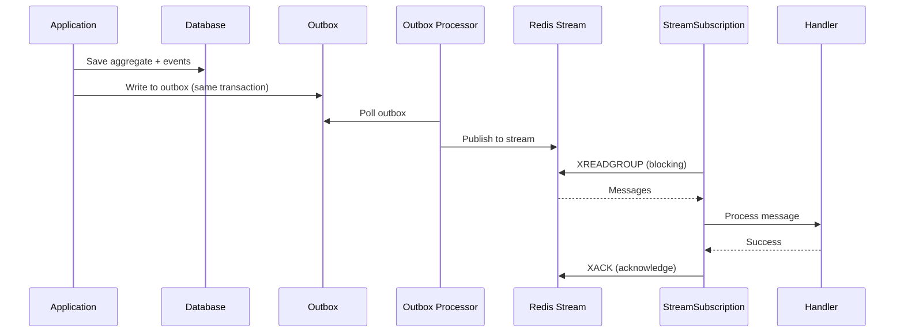
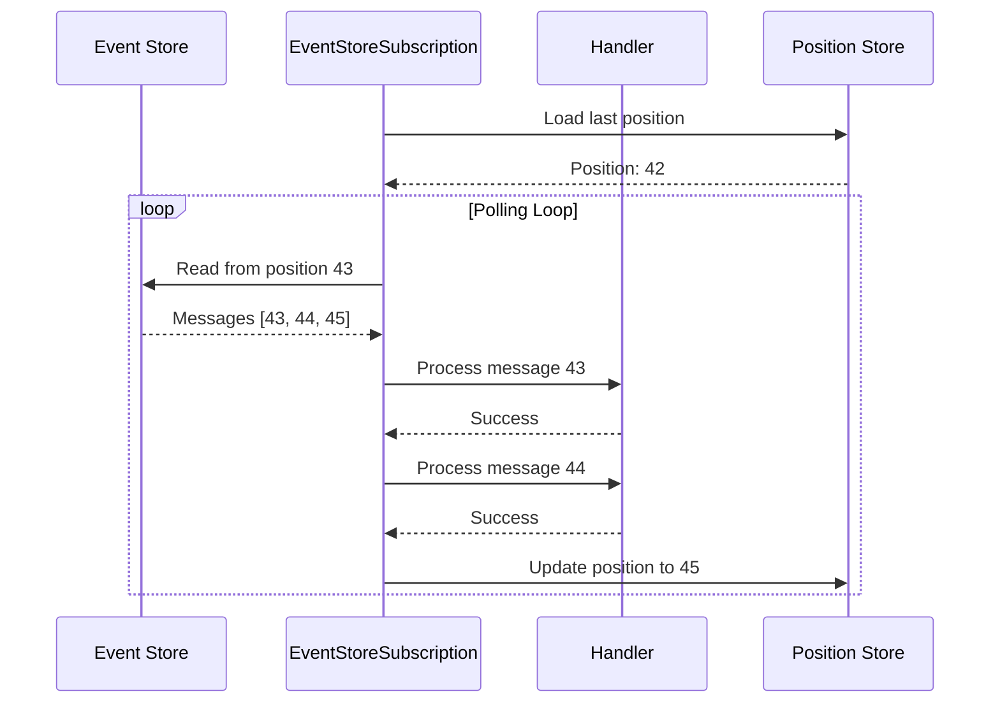

# Subscription Types

Protean provides two subscription types for connecting handlers to message
sources. Each is optimized for different use cases and provides different
guarantees.

## Overview

| Feature | StreamSubscription | EventStoreSubscription |
| ------- | ------------------ | ---------------------- |
| **Message Source** | Redis Streams | Event Store |
| **Delivery Pattern** | Push (blocking read) | Poll |
| **Consumer Groups** | Yes | No |
| **Horizontal Scaling** | Yes | Limited |
| **Dead Letter Queue** | Yes | No |
| **Automatic Retries** | Yes | No |
| **Position Tracking** | Redis (automatic) | Event Store (manual) |
| **Recommended For** | Production workloads | Projections, replay, debugging |

## StreamSubscription

`StreamSubscription` uses Redis Streams with consumer groups for reliable,
scalable message processing. This is the **recommended subscription type for
production workloads**.

### How It Works {#stream-how-it-works}



### Key Features {#stream-key-features}

#### Consumer Groups

Multiple instances of your application can process messages in parallel:

```text
Stream: orders
├── Consumer Group: OrderEventHandler
│   ├── Consumer: order-handler-host1-12345-abc123
│   ├── Consumer: order-handler-host2-12346-def456
│   └── Consumer: order-handler-host3-12347-ghi789
```

Each message is delivered to exactly one consumer in the group, enabling
horizontal scaling.

#### Blocking Reads

StreamSubscription uses Redis's `XREADGROUP` with blocking, which means:

- No CPU-intensive polling
- Low latency - messages are delivered as soon as available
- Configurable timeout for periodic maintenance

```python
# Internally uses blocking read
messages = broker.read_blocking(
    stream=stream_category,
    consumer_group=consumer_group,
    consumer_name=consumer_name,
    timeout_ms=5000,  # Block for up to 5 seconds
    count=100,        # Read up to 100 messages
)
```

#### Dead Letter Queue

Failed messages are moved to a DLQ after exhausting retries:

```text
Stream: orders
├── Main stream: orders (normal messages)
└── DLQ stream: orders:dlq (failed messages)
```

DLQ messages include metadata for debugging:

```python
{
    "original_stream": "orders",
    "original_id": "1234567890-0",
    "consumer_group": "OrderEventHandler",
    "consumer": "order-handler-host1-12345-abc123",
    "failed_at": "2024-01-15T10:30:00Z",
    "retry_count": 3,
}
```

#### Automatic Retries

Failed messages are automatically retried with configurable delays:

```python
@domain.event_handler(
    part_of=Order,
    subscription_config={
        "max_retries": 3,
        "retry_delay_seconds": 1,
    }
)
class OrderEventHandler:
    ...
```

### StreamSubscription Configuration Options

| Option | Default | Description |
| ------ | ------- | ----------- |
| `messages_per_tick` | 10 | Messages to read per batch |
| `blocking_timeout_ms` | 5000 | Blocking read timeout in milliseconds |
| `max_retries` | 3 | Retry attempts before moving to DLQ |
| `retry_delay_seconds` | 1 | Delay between retries |
| `enable_dlq` | true | Whether to use dead letter queue |

### When to Use {#stream-when-to-use}

Use StreamSubscription when you need:

- **Production reliability**: At-least-once delivery with DLQ
- **Horizontal scaling**: Multiple consumers processing in parallel
- **Retry handling**: Automatic retries for transient failures
- **Low latency**: Blocking reads minimize delay

## EventStoreSubscription

`EventStoreSubscription` reads messages directly from the event store. It's
designed for scenarios where you need direct access to the event stream.

### How It Works {#eventstore-how-it-works}



### Key Features {#eventstore-key-features}

#### Direct Event Store Access

Reads events directly from the event store, preserving the complete event
history:

```python
messages = event_store.read(
    stream_category,
    position=current_position + 1,
    no_of_messages=messages_per_tick,
)
```

#### Position Tracking

Position is stored in the event store itself as a special message type:

```python
# Position stream name
f"position-{handler_name}-{stream_category}"

# Stored as Read position message
{
    "data": {"position": 145},
    "metadata": {
        "type": "Read",
        "kind": "read_position",
        "origin_stream": "orders"
    }
}
```

#### Origin Stream Filtering

Filter messages based on their origin stream - useful when handling events
that were generated in response to specific commands:

```python
@domain.event_handler(
    part_of=Order,
    source_stream="manage_order",  # Only events triggered by manage_order commands
)
class OrderEventHandler:
    ...
```

### EventStoreSubscription Configuration Options

| Option | Default | Description |
| ------ | ------- | ----------- |
| `messages_per_tick` | 10 | Messages to read per batch |
| `tick_interval` | 1 | Seconds between polling cycles |
| `position_update_interval` | 10 | Messages between position writes |
| `origin_stream` | None | Filter by origin stream |

### When to Use {#eventstore-when-to-use}

Use EventStoreSubscription when you need:

- **Projections**: Building read models from event history
- **Event replay**: Reprocessing historical events
- **Debugging**: Inspecting event flow in development
- **Single-worker scenarios**: When horizontal scaling isn't needed

### Production Warning

When using EventStoreSubscription in production, Protean logs a warning:

```text
⚠️ EventStoreSubscription is being used in production.
For production workloads, consider using StreamSubscription which provides:
transactional outbox pattern, automatic retry mechanisms,
dead letter queue, and horizontal scaling with consumer groups.
```

This warning appears when `PROTEAN_ENV`, `PYTHON_ENV`, `ENV`, or `ENVIRONMENT`
is set to `production`, `prod`, or `prd`.

## Recommendation Summary

| Scenario | Recommended Type |
| -------- | ---------------- |
| Production event handlers | StreamSubscription |
| Production command handlers | StreamSubscription |
| Projections/read models | EventStoreSubscription |
| Event replay | EventStoreSubscription |
| Development/debugging | Either (EventStoreSubscription simpler) |
| High-throughput processing | StreamSubscription |
| Single-server deployment | Either |

## Configuration Examples

!!!note
    If you do not explicitly specify a `subscription_type` or `subscription_profile`, the defaults will be picked up from your domain configuration.

### StreamSubscription Configuration

```python
@domain.event_handler(
    part_of=Order,
    subscription_type="stream",
    subscription_config={
        "messages_per_tick": 100,
        "blocking_timeout_ms": 5000,
        "max_retries": 3,
        "retry_delay_seconds": 1,
        "enable_dlq": True,
    }
)
class OrderEventHandler:
    ...
```

Or using a profile:

```python
@domain.event_handler(
    part_of=Order,
    subscription_profile="production",
)
class OrderEventHandler:
    ...
```

### EventStoreSubscription Configuration

```python
@domain.event_handler(
    part_of=Order,
    subscription_type="event_store",
    subscription_config={
        "messages_per_tick": 100,
        "tick_interval": 1,
        "position_update_interval": 10,
    }
)
class OrderEventHandler:
    ...
```

Or using a profile:

```python
@domain.projector(
    part_of=Order,
    subscription_profile="projection",
)
class OrderProjector:
    ...
```

## Next Steps

- [Configuration](configuration.md) - Learn about configuration profiles and
  the priority hierarchy
- [Outbox Pattern](outbox.md) - Understand how StreamSubscription uses the
  transactional outbox
