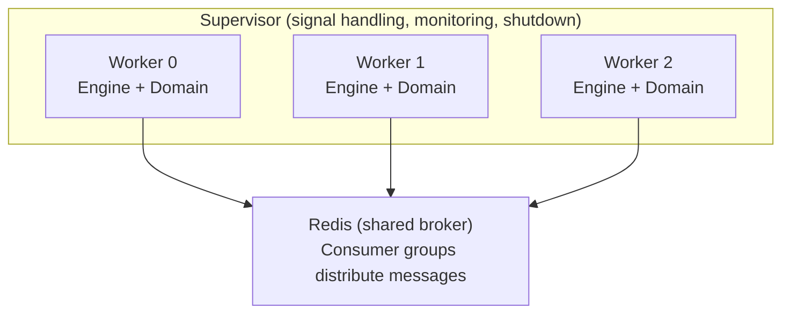

# Multi-Worker Mode

Protean can run multiple Engine worker processes from a single CLI invocation
using the `--workers` flag. The **Supervisor** spawns N independent processes,
each running its own Engine with a dedicated event loop and domain
initialization. Workers coordinate implicitly through Redis consumer groups and
database-level locking -- no IPC or shared memory is needed.

## When to Use Multiple Workers

| Scenario | Recommendation |
|----------|----------------|
| Low-volume domains, development | Single worker (`--workers 1`, the default) |
| High message throughput | Multiple workers to parallelize processing |
| CPU-bound handlers | Multiple workers to utilize multiple cores |
| High availability | Multiple workers so surviving workers continue if one crashes |

Multiple workers are most effective with **StreamSubscription**, where Redis
consumer groups distribute messages across consumers automatically. Each message
is processed by exactly one worker.

!!! note
    **EventStoreSubscription** does not distribute messages across workers.
    Multiple workers will each process the same messages independently, which is
    safe for idempotent projections but wasteful for side-effecting handlers.

## Starting Multiple Workers

```bash
# Start 4 worker processes
protean server --domain=my_domain --workers 4

# With debug logging
protean server --domain=my_domain --workers 4 --debug

# With test mode (each worker processes available messages and exits)
protean server --domain=my_domain --workers 4 --test-mode
```

## How It Works

The multi-worker architecture follows the **prefork model**:



1. The **Supervisor** spawns N worker processes using Python's `multiprocessing`
   module with the `spawn` start method (safe on all platforms, avoids
   fork-related issues with asyncio event loops and database connections).

2. Each **worker** independently derives the domain from the domain path,
   initializes it, creates its own Engine, and runs the event loop.

3. Workers coordinate through infrastructure:
   - **Redis consumer groups** distribute stream messages so each message is
     processed by exactly one worker.
   - **Database-level locking** in the OutboxProcessor prevents duplicate
     publishing when multiple workers poll the outbox table.

4. The Supervisor monitors workers and handles shutdown signals.

## Worker Coordination

### Stream Messages

Redis consumer groups handle message distribution automatically. When multiple
workers subscribe to the same stream, Redis assigns each message to one
consumer. No application-level coordination is needed.

### Outbox Processing

Each worker runs its own OutboxProcessor. To prevent multiple workers from
publishing the same outbox message, the processor uses database-level row
locking. A worker claims a message by transitioning it from `PENDING` to
`PROCESSING` with an atomic operation. If another worker tries to claim the
same message, the operation fails and that worker moves on.

See [Outbox Pattern](outbox.md#multi-worker-support) for details on the locking
mechanism.

## Signal Handling

The Supervisor installs handlers for `SIGINT`, `SIGTERM`, and `SIGHUP` (where
available). When a signal is received:

1. The Supervisor sends `SIGTERM` to each living worker process.
2. Workers receive the signal and begin their own graceful shutdown (completing
   current message processing, persisting subscription positions).
3. The Supervisor waits up to 30 seconds for workers to exit.
4. Workers that do not stop within the timeout are forcefully killed with
   `SIGKILL`.

Sending a second signal while shutdown is already in progress is ignored.

## Monitoring Workers

The Supervisor continuously monitors worker processes:

- **Clean exit** (exit code 0): The worker is removed from the pool and logged.
- **Crash** (non-zero exit code): The worker is removed, the event is logged as
  an error, and the Supervisor's exit code is set to 1.
- **All workers exited**: The Supervisor exits with the appropriate code.

!!! note
    The Supervisor does not automatically restart crashed workers. If you need
    automatic restarts, use a process manager (systemd, Docker, Kubernetes) to
    restart the entire `protean server` command.

## Exit Codes

| Code | Meaning |
|------|---------|
| 0 | All workers exited cleanly |
| 1 | One or more workers crashed |
| Non-zero (from CLI) | Propagated from the Supervisor to the CLI |

## Programmatic Usage

You can use the Supervisor directly in Python code:

```python
from protean.server.supervisor import Supervisor

supervisor = Supervisor(
    domain_path="my_package.domain",
    num_workers=4,
    test_mode=False,
    debug=False,
)
supervisor.run()  # Blocks until all workers exit

print(f"Exit code: {supervisor.exit_code}")
```

## Production Deployment

### systemd

```ini
[Unit]
Description=Protean Message Server (4 workers)
After=network.target redis.target

[Service]
Type=simple
User=app
WorkingDirectory=/app
Environment=PROTEAN_ENV=production
ExecStart=/app/.venv/bin/protean server --domain=my_domain --workers 4
Restart=always
RestartSec=5

[Install]
WantedBy=multi-user.target
```

### Docker

```dockerfile
FROM python:3.12-slim

WORKDIR /app
COPY . .
RUN pip install poetry && poetry install

ENV PROTEAN_ENV=production
CMD ["poetry", "run", "protean", "server", "--domain=my_domain", "--workers", "4"]
```

### Kubernetes

With multiple workers per pod, you can reduce replica count while maintaining
throughput. Each pod runs a Supervisor with N workers:

```yaml
apiVersion: apps/v1
kind: Deployment
metadata:
  name: protean-server
spec:
  replicas: 2  # 2 pods × 4 workers = 8 total workers
  selector:
    matchLabels:
      app: protean-server
  template:
    spec:
      containers:
      - name: server
        image: my-app:latest
        command: ["protean", "server", "--domain=my_domain", "--workers", "4"]
        resources:
          requests:
            cpu: "1000m"
            memory: "512Mi"
```

## Next Steps

- [Running the Server](running.md) -- CLI options, single-worker mode, and
  general deployment guidance
- [Outbox Pattern](outbox.md) -- How the outbox ensures reliable delivery in
  multi-worker deployments
- [Engine Architecture](engine.md) -- How each worker's Engine processes
  messages
