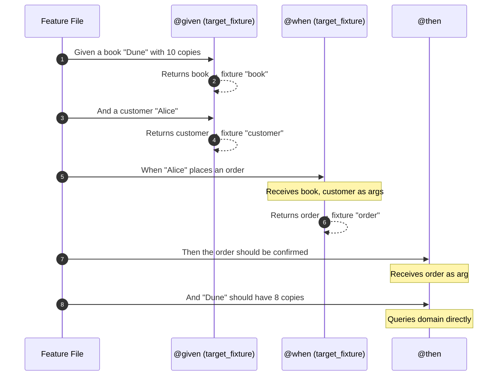

# Application Tests

Application tests validate the **orchestration layer** — commands, command
handlers, event handlers, and application services. They naturally follow a
BDD structure: *Given* a domain state, *When* a command is processed, *Then*
verify the outcomes.

We recommend **[pytest-bdd](https://pytest-bdd.readthedocs.io/)** for writing
these tests. It uses Gherkin feature files to express scenarios in plain
language and maps each step to a Python function, integrating seamlessly with
pytest fixtures.

## Key Facts

- Application tests exercise the full processing pipeline: command dispatch,
  handler execution, aggregate mutation, event raising, and persistence.
- They use synchronous processing (`"sync"`) so events and commands are
  handled immediately within the test, making assertions deterministic.
- They run entirely in-memory — no infrastructure required.
- Feature files serve as living documentation of your application's behavior.
- Steps are shared via `conftest.py` and reused across scenarios.

## Installing pytest-bdd

```shell
pip install pytest-bdd
```

Or with Poetry:

```shell
poetry add --group test pytest-bdd
```

## Project Structure

Organize feature files by domain concept and co-locate step definitions
nearby:

```
tests/
├── conftest.py                  # Root fixtures (domain, context)
├── bdd/
│   ├── conftest.py              # Shared BDD steps and fixtures
│   ├── registration/
│   │   ├── features/
│   │   │   ├── register_user.feature
│   │   │   └── activate_user.feature
│   │   ├── conftest.py          # Registration shared steps
│   │   ├── test_register_user.py
│   │   └── test_activate_user.py
│   ├── ordering/
│   │   ├── features/
│   │   │   ├── place_order.feature
│   │   │   └── cancel_order.feature
│   │   ├── conftest.py          # Ordering shared steps
│   │   ├── test_place_order.py
│   │   └── test_cancel_order.py
│   └── catalog/
│       ├── features/
│       │   └── manage_books.feature
│       ├── conftest.py
│       └── test_manage_books.py
└── unit/
    └── ...                      # Domain model tests (plain pytest)
```

Each domain concept gets its own directory with feature files and step
definitions. Shared steps (like creating common entities) live in
`conftest.py` files at the appropriate level.

## Writing Feature Files

Feature files describe application behavior in Gherkin — a structured,
readable format that maps directly to your domain language.

### A Command Processing Scenario

```gherkin
# tests/bdd/registration/features/register_user.feature
Feature: User Registration
    Users should be able to register through the Register command
    and receive a welcome notification.

    Background:
        Given the domain is initialized

    Scenario: Register a new user
        When a Register command is processed for "john@example.com"
        Then a user should exist with email "john@example.com"
        And the user status should be "INACTIVE"

    Scenario: Registration triggers a welcome notification
        When a Register command is processed for "jane@example.com"
        Then a welcome notification should have been sent to "jane@example.com"

    Scenario: Duplicate registration is rejected
        Given a user already exists with email "john@example.com"
        When a Register command is processed for "john@example.com"
        Then the command should fail with error "already registered"
```

Use `Background` to express setup steps shared by every scenario in a feature
file. Only `Given` steps belong in a Background.

### An Event Handler Scenario

```gherkin
# tests/bdd/ordering/features/place_order.feature
@ordering
Feature: Place Order
    Customers can place orders that trigger inventory updates
    and customer history tracking.

    Background:
        Given the domain is initialized

    Scenario: Placing an order updates inventory
        Given a book "Dune" with 10 copies in stock
        And a customer "Alice"
        When "Alice" places an order for 2 copies of "Dune"
        Then the order should be confirmed
        And "Dune" should have 8 copies in stock

    Scenario: Placing an order records customer history
        Given a book "1984" with 5 copies in stock
        And a customer "Bob"
        When "Bob" places an order for 1 copy of "1984"
        Then "Bob" should have 1 order in their history

    Scenario: Cannot order more than available stock
        Given a book "Rare Book" with 2 copies in stock
        And a customer "Charlie"
        When "Charlie" tries to order 10 copies of "Rare Book"
        Then the order should be rejected with "Insufficient stock"
```

### Scenario Outlines for Data-Driven Tests

Use Scenario Outlines when the same flow applies to multiple inputs:

```gherkin
    Scenario Outline: Order total is calculated correctly
        Given a customer "Alice"
        And "Alice" adds <quantity> copies of a book priced at <price>
        When "Alice" places the order
        Then the order total should be <total>

        Examples:
            | quantity | price | total  |
            | 1        | 10.00 | 10.00  |
            | 3        | 20.00 | 60.00  |
            | 2        | 15.50 | 31.00  |
```

## Writing Step Definitions

Step definitions are Python functions decorated with `@given`, `@when`, or
`@then`. They connect Gherkin steps to your Protean domain code.

### Binding Scenarios

Use `scenarios()` to bind all scenarios in a feature file to a test module.
It automatically creates a test function for each scenario — you only need to
provide the step definitions:

```python
# tests/bdd/registration/test_register_user.py
from uuid import uuid4

from pytest_bdd import scenarios, when, then, parsers

from myapp import domain
from myapp.commands import Register
from myapp.models import User

scenarios("features/register_user.feature")


@when(parsers.parse('a Register command is processed for "{email}"'))
def process_register(email):
    domain.process(
        Register(user_id=str(uuid4()), email=email, name="Test User")
    )


@then(parsers.parse('a user should exist with email "{email}"'))
def user_exists(email):
    users = domain.repository_for(User)._dao.query.all()
    match = [u for u in users.items if u.email == email]
    assert len(match) == 1


@then(parsers.parse('the user status should be "{status}"'))
def user_has_status(email, status):
    users = domain.repository_for(User)._dao.query.all()
    user = next(u for u in users.items if u.email == email)
    assert user.status == status
```

### Sharing State with `target_fixture`

Use `target_fixture` to pass data between steps. The return value of the step
becomes a pytest fixture available to all subsequent steps in the same
scenario:

```python
# tests/bdd/ordering/test_place_order.py
from pytest_bdd import scenarios, given, when, then, parsers

from myapp import domain
from myapp.commands import PlaceOrder
from myapp.models import Book, Customer, Inventory, Money, Order, OrderItemVO

scenarios("features/place_order.feature")


@given(
    parsers.parse('a book "{title}" with {stock:d} copies in stock'),
    target_fixture="book",
)
def book_in_stock(title, stock):
    book = Book(title=title, author="Test Author", price=Money(amount=15.99))
    domain.repository_for(Book).add(book)

    inventory = Inventory(book_id=book.id, title=title, quantity=stock)
    domain.repository_for(Inventory).add(inventory)
    return book


@given(
    parsers.parse('a customer "{name}"'),
    target_fixture="customer",
)
def existing_customer(name):
    customer = Customer(name=name)
    domain.repository_for(Customer).add(customer)
    return customer


@when(
    parsers.parse('"{name}" places an order for {qty:d} copies of "{title}"'),
    target_fixture="order",
)
def place_order(customer, book, name, qty, title):
    domain.process(
        PlaceOrder(
            customer_id=customer.id,
            items=[OrderItemVO(book_id=book.id, quantity=qty)],
            total=book.price.amount * qty,
        )
    )
    orders = domain.repository_for(Order)._dao.query.all()
    return orders.items[0]


@then("the order should be confirmed")
def order_confirmed(order):
    assert order.status == "CONFIRMED"


@then(parsers.parse('"{title}" should have {expected:d} copies in stock'))
def check_stock(title, expected):
    inventories = domain.repository_for(Inventory)._dao.query.all()
    inv = next(i for i in inventories.items if i.title == title)
    assert inv.quantity == expected
```

The flow of fixtures through a scenario looks like this:



### Handling Expected Failures

When testing that a command is rejected, capture the exception in the `@when`
step and verify it in `@then`:

```python
@when(
    parsers.parse(
        '"{name}" tries to order {qty:d} copies of "{title}"'
    ),
    target_fixture="order_result",
)
def try_place_order(customer, book, name, qty, title):
    try:
        domain.process(
            PlaceOrder(
                customer_id=customer.id,
                items=[OrderItemVO(book_id=book.id, quantity=qty)],
                total=book.price.amount * qty,
            )
        )
        return {"success": True}
    except ValidationError as exc:
        return {"success": False, "error": str(exc.messages)}


@then(parsers.parse('the order should be rejected with "{message}"'))
def order_rejected(order_result, message):
    assert order_result["success"] is False
    assert message in order_result["error"]
```

### Scenario Outline Steps

For Scenario Outlines, use `parsers.parse` with format specifiers to extract
typed values:

```python
@given(
    parsers.parse(
        '"{name}" adds {quantity:d} copies of a book priced at {price:f}'
    ),
    target_fixture="cart",
)
def add_to_cart(customer, name, quantity, price):
    book = Book(
        title="Test Book", author="Author", price=Money(amount=price)
    )
    domain.repository_for(Book).add(book)
    return {"book": book, "quantity": quantity}


@when(
    parsers.parse('"{name}" places the order'),
    target_fixture="order",
)
def place_order_from_cart(customer, cart, name):
    domain.process(
        PlaceOrder(
            customer_id=customer.id,
            items=[
                OrderItemVO(
                    book_id=cart["book"].id, quantity=cart["quantity"]
                )
            ],
            total=cart["book"].price.amount * cart["quantity"],
        )
    )
    orders = domain.repository_for(Order)._dao.query.all()  # noqa: E501
    return orders.items[0]


@then(parsers.parse("the order total should be {expected:f}"))
def check_total(order, expected):
    assert float(order.total) == expected
```

Common format specifiers for `parsers.parse`:

| Specifier | Type | Example |
|-----------|------|---------|
| `{name}` | `str` (default) | `"Alice"` |
| `{count:d}` | `int` | `42` |
| `{price:f}` | `float` | `19.99` |
| `{word:w}` | word (no spaces) | `ACTIVE` |

## Shared Steps in `conftest.py`

Steps that appear across multiple feature files belong in `conftest.py`.
pytest-bdd discovers step definitions defined there automatically.

### Root-Level Shared Steps

The top-level `conftest.py` imports your application's domain and provides
the domain fixture and shared steps:

```python
# tests/bdd/conftest.py
import pytest
from pytest_bdd import given

from myapp import domain


@pytest.fixture(autouse=True)
def setup_domain():
    domain.config["event_processing"] = "sync"
    domain.config["command_processing"] = "sync"
    domain.init()

    with domain.domain_context():
        yield


@given("the domain is initialized")
def domain_initialized():
    """Background step — domain is already initialized by the fixture."""
    pass
```

Since your domain elements are decorated in your application code (e.g.
`@domain.aggregate`, `@domain.command_handler`), calling `domain.init()`
discovers and wires them automatically. No manual registration is needed.

### Domain-Specific Shared Steps

Steps shared within a single domain concept go in that directory's
`conftest.py`:

```python
# tests/bdd/ordering/conftest.py
from pytest_bdd import given, parsers

from myapp import domain
from myapp.models import Book, Customer, Inventory, Money


@given(
    parsers.parse('a customer "{name}"'),
    target_fixture="customer",
)
def existing_customer(name):
    customer = Customer(name=name)
    domain.repository_for(Customer).add(customer)
    return customer


@given(
    parsers.parse('a book "{title}" with {stock:d} copies in stock'),
    target_fixture="book",
)
def book_in_stock(title, stock):
    book = Book(
        title=title, author="Test Author", price=Money(amount=15.99)
    )
    domain.repository_for(Book).add(book)
    inventory = Inventory(book_id=book.id, title=title, quantity=stock)
    domain.repository_for(Inventory).add(inventory)
    return book
```

These steps are now available to all test modules under
`tests/bdd/ordering/` without re-definition. The step hierarchy follows
pytest's `conftest.py` discovery:

```
tests/bdd/conftest.py             → steps available everywhere
tests/bdd/ordering/conftest.py    → steps available in ordering/ tests
tests/bdd/registration/conftest.py → steps available in registration/ tests
```

## Testing Application Services

Application services coordinate use cases. Write feature files that describe
the use case, and step definitions that invoke the service:

```gherkin
# tests/bdd/registration/features/activate_user.feature
Feature: User Activation
    Registered users can be activated through the application service.

    Background:
        Given the domain is initialized

    Scenario: Activate a registered user
        Given a registered user "john@example.com"
        When the user is activated
        Then the user status should be "ACTIVE"

    Scenario: Cannot activate a non-existent user
        When activation is attempted for a non-existent user
        Then the operation should fail with "not found"
```

```python
# tests/bdd/registration/test_activate_user.py
from pytest_bdd import scenarios, given, when, then, parsers

from myapp import domain
from myapp.models import User
from myapp.services import UserApplicationServices

scenarios("features/activate_user.feature")


@given(
    parsers.parse('a registered user "{email}"'),
    target_fixture="user_id",
)
def registered_user(email):
    app_service = UserApplicationServices()
    return app_service.register_user(email=email, name="Test User")


@when("the user is activated")
def activate_user(user_id):
    app_service = UserApplicationServices()
    app_service.activate_user(user_id)


@when(
    "activation is attempted for a non-existent user",
    target_fixture="activation_result",
)
def activate_nonexistent():
    try:
        app_service = UserApplicationServices()
        app_service.activate_user("nonexistent-id")
        return {"success": True}
    except ObjectNotFoundError as exc:
        return {"success": False, "error": str(exc)}


@then(parsers.parse('the user status should be "{status}"'))
def check_status(user_id, status):
    user = domain.repository_for(User).get(user_id)
    assert user.status == status


@then(parsers.parse('the operation should fail with "{message}"'))
def check_failure(activation_result, message):
    assert activation_result["success"] is False
    assert message in activation_result["error"]
```

## Using Tags for Selective Execution

Gherkin tags are converted to pytest markers. Use them to organize and filter
scenarios:

```gherkin
@ordering @smoke
Feature: Place Order
    ...

    @happy_path
    Scenario: Placing an order updates inventory
        ...

    @validation
    Scenario: Cannot order more than available stock
        ...
```

Run selectively:

```shell
# Run only ordering scenarios
pytest tests/bdd/ -m ordering

# Run only smoke tests
pytest tests/bdd/ -m smoke

# Run happy path scenarios, skip validation
pytest tests/bdd/ -m "happy_path and not validation"
```

## Tips for Good Feature Files

- **Name features after domain concepts** — "User Registration", not
  "Test UserCommandHandler".
- **Write from the user's perspective** — describe *what* happens, not
  *how* it's implemented.
- **Keep Background sections short** — only shared `Given` steps belong there.
- **Use concrete examples** — `"john@example.com"` reads better than abstract
  placeholders in non-outline scenarios.
- **One scenario, one behavior** — test a single outcome per scenario. Use
  separate scenarios for the happy path and each error case.
- **Reuse steps** — write steps general enough to appear in multiple
  scenarios. Put them in `conftest.py`.

!!!note
    Setting `command_processing` and `event_processing` to `"sync"` is
    essential for application tests. It ensures commands are handled
    immediately and events are dispatched synchronously, so your `@then` steps
    can verify outcomes deterministically.
