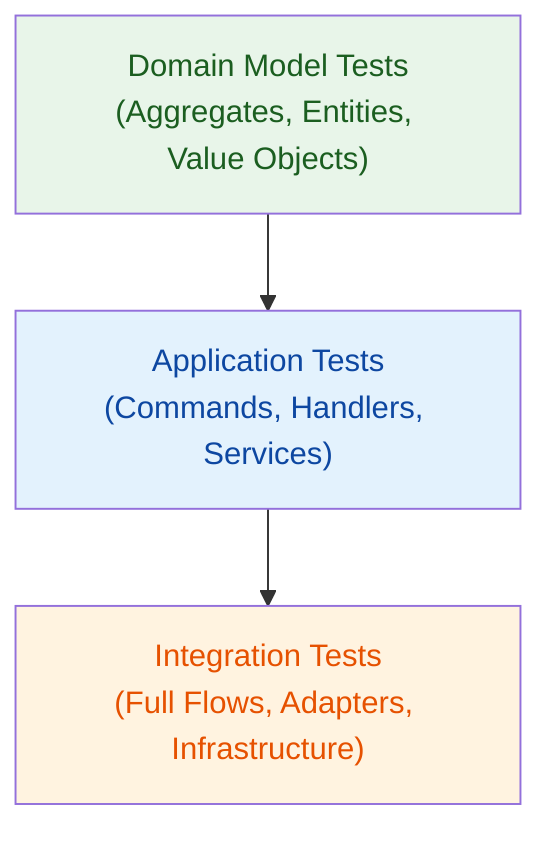

# Testing

Protean is designed with testability at its core. By isolating the domain model
from infrastructure, you can achieve comprehensive test coverage using fast,
in-memory adapters and swap in real technologies only when needed.

## Testing Philosophy

Protean encourages a layered testing strategy that mirrors how you build your
application:

1. **Test domain logic, not framework mechanics** — you don't need to verify
   that `String(required=True)` raises a validation error. Focus on *your*
   business rules, invariants, and state transitions.
2. **Avoid mocks** — use real (in-memory) adapters instead. They behave like
   production adapters but need no infrastructure. Reserve mocks for rare
   cases like external API calls.
3. **Test the whole flow** — commands, events, handlers, and projections
   work together. Validate their interactions, not just individual units.
4. **Aim for 100% coverage** — all domain model code, command handlers, event
   handlers, and application services should be fully covered. Configuration
   files, setup scripts, and adapter glue code can be excluded.

## Testing Layers

Protean applications lend themselves to three complementary layers of tests:

| Layer | What You Test | How You Test |
|-------|--------------|--------------|
| **Domain Model** | State transitions, invariants, custom value object logic, domain services | Unit tests — instantiate objects directly and assert state |
| **Application** | Commands, command handlers, event handlers, application services | BDD-style tests — Given a state, When a command is processed, Then verify outcomes |
| **Integration** | Full flows across aggregates, projections, and infrastructure | End-to-end tests — process commands, verify events, check projections and persistence |

Each layer builds on the one below. Domain model tests are fast and isolated.
Application tests exercise the orchestration layer. Integration tests verify
that everything works together.

## Coverage Goals

The goal is **100% test coverage** on all business logic:

- **Always cover:** Aggregates, entities, value objects, invariants, domain
  services, commands, command handlers, event handlers, application services,
  projections, projectors.
- **Exclude from coverage targets:** Configuration files (`domain.toml`),
  framework setup, adapter wiring, `__init__.py` files, and infrastructure
  bootstrapping code.

## What's in This Section

- **[Domain Model Tests](./domain-model-tests.md)** — unit testing aggregates,
  entities, value objects, invariants, and domain services.
- **[Application Tests](./application-tests.md)** — BDD-style testing of
  commands, handlers, and application services.
- **[Integration Tests](./integration-tests.md)** — end-to-end flows
  with real infrastructure adapters.
- **[Fixtures and Patterns](./fixtures-and-patterns.md)** — reusable pytest
  fixtures and `conftest.py` recipes for Protean projects.
