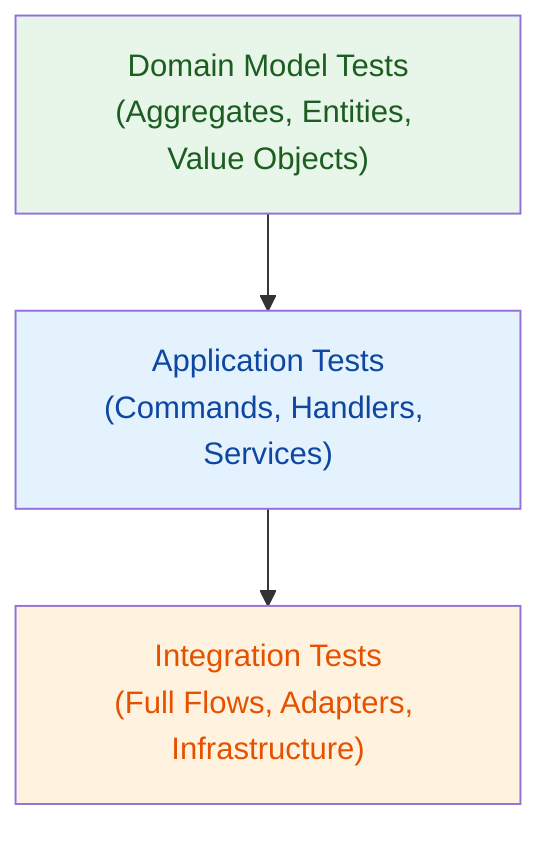

# Test Your Application

<span class="pathway-tag pathway-tag-ddd">DDD</span> <span class="pathway-tag pathway-tag-cqrs">CQRS</span> <span class="pathway-tag pathway-tag-es">ES</span>

Because the domain model is separated from infrastructure, you can test all of
it with fast in-memory adapters, and bring in the real technologies only where
a test needs them.

## How to think about testing

Protean encourages a layered testing strategy that mirrors how you build your
application:

1. **Test domain logic, not framework mechanics**: You don't need to verify
   that `String(required=True)` raises a validation error. Focus on *your*
   business rules, invariants, and state transitions.
2. **Avoid mocks**: Use real (in-memory) adapters instead. They behave like
   production adapters but need no infrastructure. Reserve mocks for rare
   cases like external API calls.
3. **Test the whole flow**: Commands, events, handlers, and projections
   work together. Validate their interactions, not just individual units.
4. **Cover the domain fully**: Domain model code, command handlers, event
   handlers, and application services are worth covering completely.
   Configuration files, setup scripts, and adapter glue code are not.

## Testing Layers

Protean applications lend themselves to three complementary layers of tests:

| Layer | What You Test | How You Test |
|-------|--------------|--------------|
| **Domain Model** | State transitions, invariants, custom value object logic, domain services | Unit tests, instantiate objects directly and assert state |
| **Application** | Commands, command handlers, event handlers, application services | BDD-style tests, Given a state, When a command is processed, Then verify outcomes |
| **Integration** | Full flows across aggregates, projections, and infrastructure | End-to-end tests, process commands, verify events, check projections and persistence |

Each layer builds on the one below. Domain model tests are fast and isolated.
Application tests exercise the orchestration layer. Integration tests verify
that everything works together.


```mermaid
graph TD
    A["Domain Model Tests<br/>(Aggregates, Entities, Value Objects)"] --> B["Application Tests<br/>(Commands, Handlers, Services)"]
    B --> C["Integration Tests<br/>(Full Flows, Adapters, Infrastructure)"]

    style A fill:#e8f5e9,color:#1b5e20
    style B fill:#e3f2fd,color:#0d47a1
    style C fill:#fff3e0,color:#e65100
```

## Coverage Goals

The goal is **100% test coverage** on all business logic:

- **Always cover:** Aggregates, entities, value objects, invariants, domain
  services, commands, command handlers, event handlers, application services,
  projections, projectors.
- **Exclude from coverage targets:** Configuration files (`domain.toml`),
  framework setup, adapter wiring, `__init__.py` files, and infrastructure
  bootstrapping code.

## Pytest Plugin and `DomainFixture`

Protean ships with a **pytest plugin** that is automatically activated when
Protean is installed. It sets `PROTEAN_ENV` before test collection (so
`domain.toml` environment overlays are applied) and registers standard
test-category markers.

Protean also provides `DomainFixture`, a test lifecycle manager that handles domain
initialization, database schema setup/teardown, and per-test data cleanup
across all adapters. See [Fixtures and Patterns](./fixtures-and-patterns.md)
for full details and recipes.

## Dual-Mode Testing

Protean's memory adapters are complete implementations (not stubs) that behave
identically to real adapters for domain logic. This enables
**dual-mode testing**: run the same test suite with in-memory adapters for
fast feedback and with real infrastructure for final validation.

```shell
# Fast — no Docker, no databases
pytest --protean-env memory

# Thorough — real PostgreSQL, Redis, Message DB
pytest
```

Switch modes with a single CLI flag and **zero test code changes**. Add a
`[memory]` overlay to your `domain.toml` and every test, fixture, and BDD
scenario works in both modes automatically.

See the [Dual-Mode Testing](../../patterns/dual-mode-testing.md)
guide for the full setup, CI configuration, and guidance on when modes
may diverge.

## Guides in this section

- **[Domain Model Tests](./domain-model-tests.md)**: Unit testing aggregates,
  entities, value objects, invariants, and domain services.
- **[Application Tests](./application-tests.md)**: BDD-style testing of
  commands, handlers, and application services.
- **[Event Sourcing Tests](./event-sourcing-tests.md)** <span
  class="pathway-tag pathway-tag-es">ES</span>, fluent test DSL for
  event-sourced aggregates using `protean.testing.given`.
- **[Integration Tests](./integration-tests.md)**: End-to-end flows
  with real infrastructure adapters.
- **[Test Query Shape](./query-shape-tests.md)**: Assert query count and shape
  (round trips, subquery wraps, over-fetch) to catch query-cost regressions.
- **[Fixtures and Patterns](./fixtures-and-patterns.md)**: Reusable pytest
  fixtures, `DomainFixture`, and `conftest.py` recipes for Protean projects.
