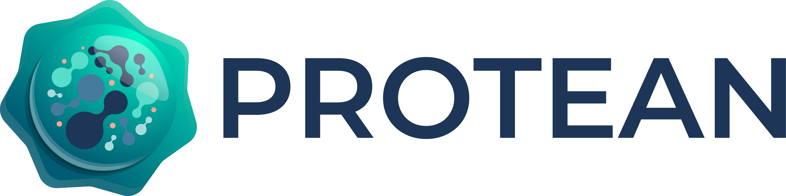

{ width="400" }
# Pragmatic Framework for Ambitious Applications

Protean is an open-source python framework designed to build ambitious
applications that scale and evolve with your business.

## Overview

**Protean helps you build applications architected for *change* and *growth*.**

Protean offers the tools and patterns necessary for creating sustainable,
domain-driven codebases, utilizing CQRS and Event-Sourcing to tackle complexity
in high-stakes domains.

At its core, Protean adopts a Domain-Driven Design (DDD) approach to
development, with support for patterns to succinctly and precisely express
your domain without worrying about technology aspects. When you are ready,
you can seamlessly plugin technologies like databases, message brokers, and
caches, and Protean will take care of the rest.

Protean is loosely based on three paradigms:

- **Service-Oriented**: Develop your application as one or more subdomains
that can run independently as Microservices
- **Event-Driven**: Use events to propagate changes across aggregates and
subdomains to sync state within and across Bounded Contexts.
- **Adapter-Based**: A configuration-driven approach to specify technology
adapters, with multiple adapters supported out of the box.

## Features

-   __:material-run-fast: Rapid Prototyping__

    ---

    Prototype and rapidly iterate your domain model with core DDD tactical
    patterns. [:material-arrow-right-box:](features.md#rapid-prototyping)

-   __:material-database-plus-outline: Technology Agnostic__

    ---

    Model your domain without worrying about technology choice. Delay your
    decisions until the last responsible moment. [:material-arrow-right-box:](features.md#technology-independence)

-   __:material-power-plug-battery-outline: Pluggable Adapters__

    ---

    Use a Configuration-based approach to specify your application's
    infrastructure. Decouple your application from your technology. [:material-arrow-right-box:](features.md#ports-and-adapters)

-   __:material-card-multiple-outline: Multi-domain Codebase__
    
    ---

    Evolve and structure your application's bounded contexts over time as you
    understand better. [:material-arrow-right-box:](features.md#multi-domain-codebase)

-   __:material-star-shooting-outline: Event-centric Communication__

    ---

    Use Domain Events to sync state across Aggregates and Bounded contexts,
    creating a loosely-coupled, highly-scalable ecosystem. [:material-arrow-right-box:](features.md#event-centric-communication)

-   __:material-check-outline: 100% Coverage__

    ---

    Completely cover your domain model with tests that can run in memory or
    with your chosen technlogies. [:material-arrow-right-box:](features.md#testability)

