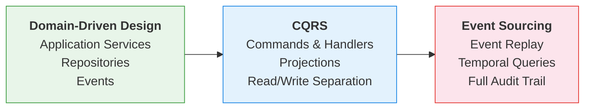

{ width="400" }
# Pragmatic Framework for Ambitious Applications

[](https://github.com/proteanhq/protean/)
[](https://pypi.org/project/protean/)
[](https://github.com/proteanhq/protean/actions/workflows/ci.yml)
[](https://codecov.io/gh/proteanhq/protean)

Build domain-driven Python applications with clean architecture.
Protean gives you DDD, CQRS, and Event Sourcing — with pluggable
infrastructure and zero boilerplate.

[Get Started](./guides/getting-started/quickstart.md){ .md-button .md-button--primary }
[Tutorial](./guides/getting-started/tutorial/index.md){ .md-button }
[All Content](./contents.md){ .md-button }

---

## See It in Action

```python
from protean import Domain, handle
from protean.fields import Identifier, String, Text
from protean.utils.globals import current_domain

domain = Domain() # (1)!

@domain.aggregate # (2)!
class Post:
    title: String(max_length=100, required=True)
    body: Text(required=True)
    status: String(max_length=20, default="DRAFT")

    def publish(self):
        self.status = "PUBLISHED"
        self.raise_(PostPublished(post_id=self.id, title=self.title)) # (3)!

@domain.event(part_of="Post") # (4)!
class PostPublished:
    post_id: Identifier(required=True)
    title: String(required=True)

@domain.command(part_of="Post") # (5)!
class CreatePost:
    title: String(max_length=100, required=True)
    body: Text(required=True)

@domain.command_handler(part_of=Post) # (6)!
class PostCommandHandler:
    @handle(CreatePost)
    def create_post(self, command: CreatePost):
        post = Post(title=command.title, body=command.body)
        current_domain.repository_for(Post).add(post) # (7)!
        return post.id
```

1. :material-domain: **Domain** — The central registry that wires all elements together.
2. :material-cube-outline: **Aggregate** — The core building block encapsulating fields and business logic.
3. :material-bell-ring-outline: **Raising an Event** — `raise_()` emits a domain event to notify the rest of the system.
4. :material-lightning-bolt: **Event** — An immutable record of something that happened in the domain.
5. :material-play-circle-outline: **Command** — An intent to change state, carrying just the needed data.
6. :material-cog-outline: **Command Handler** — Receives a command, creates/updates aggregates, and persists them.
7. :material-database-outline: **Repository** — Built-in persistence abstraction to add, get, or remove aggregates without touching the database directly.

Aggregates, commands, events, and handlers — all in pure Python, with
decorators that wire everything together. No infrastructure required
to get started.

---

## Why Protean?

<div class="grid cards" markdown>

-   __:material-domain: Domain-First__

    ---

    Model your business in pure Python. No ORM inheritance, no framework
    lock-in. Your domain code reads like the business, enabling
    collaboration between developers and domain experts.

-   __:material-power-plug-battery-outline: Plug In Infrastructure Later__

    ---

    Start with in-memory adapters — no database, no broker, no setup.
    When you're ready, swap in PostgreSQL, Redis, Elasticsearch, or
    MessageDB through configuration. No code changes.

-   __:material-call-split: Three Architectural Paths__

    ---

    Begin with DDD, evolve to CQRS, adopt Event Sourcing — all within
    the same framework. Mix patterns per aggregate. Pragmatism over
    purity.

-   __:material-test-tube: Test Everything__

    ---

    3,826 tests with a 3.5:1 test-to-code ratio. Run your full domain
    test suite in-memory in seconds. Every commit is tested against
    PostgreSQL, Redis, Elasticsearch, MessageDB, and MSSQL across
    Python 3.11-3.14.

</div>

---

## Choose Your Path

Protean supports three architectural approaches. Each builds on the one
before it — start simple and add sophistication as your needs evolve.



<div class="grid cards" markdown>

-   __:material-shield-outline: Domain-Driven Design__

    ---

    Clean domain modeling with application services, repositories, and
    event-driven side effects. The simplest way to start.

    [:material-arrow-right-box: DDD Pathway](./guides/pathways/ddd.md)

-   __:material-call-split: CQRS__

    ---

    Separate reads from writes with commands, command handlers, and
    read-optimized projections.

    [:material-arrow-right-box: CQRS Pathway](./guides/pathways/cqrs.md)

-   __:material-history: Event Sourcing__

    ---

    Derive state from event replay. Full audit trail, temporal queries,
    and complete traceability.

    [:material-arrow-right-box: Event Sourcing Pathway](./guides/pathways/event-sourcing.md)

</div>

Not sure which to pick? Start with DDD — you can evolve later. See
[Choose a Path](./guides/pathways/index.md) for guidance.

---

## Built to Last

<div class="grid cards" markdown>

-   __:material-test-tube: 3,826 Tests__

    ---

    3.5:1 test-to-code ratio. Every commit validated against PostgreSQL,
    Redis, Elasticsearch, MessageDB, and MSSQL.

-   __:material-check-decagram: Zero Lint Violations__

    ---

    Fully clean Ruff linting and formatting, enforced on every commit
    via pre-commit hooks.

-   __:material-chart-line: A-Grade Maintainability__

    ---

    97% of source files score in the highest maintainability tier.
    Average cyclomatic complexity of 2.97.

-   __:material-puzzle-outline: 12 Adapters, 5 Ports__

    ---

    Pluggable infrastructure across databases, brokers, event stores,
    and caches — tested across 4 Python versions.

</div>

[:material-arrow-right-box: Full Quality Report](./community/quality.md){ .md-button }

---

## Explore the Documentation

<div class="grid cards" markdown>

-   __:material-rocket-launch-outline: Quickstart__

    ---

    Build a domain in 5 minutes — no infrastructure required.

    [:material-arrow-right-box: Quickstart](./guides/getting-started/quickstart.md)

-   __:material-school-outline: Tutorial__

    ---

    15-part guide from your first aggregate to production.

    [:material-arrow-right-box: Tutorial](./guides/getting-started/tutorial/index.md)

-   __:material-book-open-page-variant-outline: Guides__

    ---

    Deep reference for every concept, pattern, and technique.

    [:material-arrow-right-box: Guides](./guides/index.md)

-   __:material-lightbulb-outline: Core Concepts__

    ---

    DDD, CQRS, and Event Sourcing explained.

    [:material-arrow-right-box: Core Concepts](./core-concepts/ddd.md)

-   __:material-puzzle-outline: Adapters__

    ---

    PostgreSQL, Redis, Elasticsearch, MessageDB, and more.

    [:material-arrow-right-box: Adapters](./adapters/index.md)

-   __:material-flask-outline: Patterns & Recipes__

    ---

    Battle-tested solutions for common challenges.

    [:material-arrow-right-box: Patterns](./patterns/index.md)

-   __:material-magnify: How Do I...?__

    ---

    Find the right guide by what you're trying to accomplish.

    [:material-arrow-right-box: How Do I...?](./how-do-i.md)

</div>
