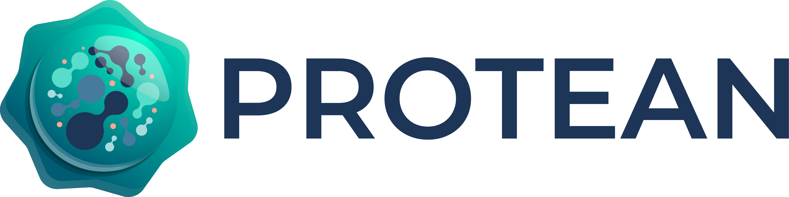

{ width="400" }
# Your whiteboard, shipped.

[](https://github.com/proteanhq/protean/)
[](https://pypi.org/project/protean/)
[](https://github.com/proteanhq/protean/actions/workflows/ci.yml)
[](https://codecov.io/gh/proteanhq/protean)
[](https://github.com/proteanhq/protean/actions/workflows/ci.yml)
[](https://docs.proteanhq.com/community/quality/)

A Python framework for domain-driven systems. Sketch aggregates, events,
and bounded contexts on a whiteboard. Then write them in Python, exactly
as you drew them.

Start with DDD, evolve to CQRS or Event Sourcing, swap
infrastructure through configuration.

**Your domain model is the architecture.**

[Ship the Whiteboard](./guides/getting-started/hello.md){ .md-button .md-button--primary }
[Tutorial](./guides/getting-started/tutorial/index.md){ .md-button }
[Why Protean?](./why-protean.md){ .md-button }
[How Do I...?](./how-do-i.md){ .md-button }

---

## Why Protean?

<div class="grid cards" markdown>

-   __:material-magnify-scan: Domain Compiler__

    ---

    Your domain model is a machine-readable specification. Protean builds
    an Intermediate Representation (IR) that enables derived docs, API
    specs, contracts, and visual exploration.

-   __:material-shield-check-outline: Always-Valid Domain__

    ---

    Domain objects are always valid, or they don't exist. Four validation
    layers -- field constraints, value object invariants, aggregate rules,
    handler guards -- enforced on every change, automatically.

-   __:material-call-split: Progressive Architecture__

    ---

    Start with DDD, evolve to CQRS, adopt Event Sourcing -- all within
    the same framework. Mix patterns per aggregate. Pragmatism over
    purity.

-   __:material-power-plug-battery-outline: Infrastructure Portability__

    ---

    Start with in-memory adapters -- no database, no broker, no setup.
    When you're ready, swap in PostgreSQL, Redis, Elasticsearch, or
    MessageDB through configuration. No code changes.

</div>

[:material-arrow-right-box: Read more -- Why Protean?](./why-protean.md){ .md-button }

---

## See it in action

```python
from protean import Domain, handle
from protean.fields import Identifier, String, Text
from protean.utils.globals import current_domain

domain = Domain() # (1)!

@domain.aggregate # (2)!
class Post:
    title: String(max_length=100, required=True)
    body: Text(required=True)
    status: String(max_length=20, default="DRAFT")

    def publish(self):
        self.status = "PUBLISHED"
        self.raise_(PostPublished(post_id=self.id, title=self.title)) # (3)!

@domain.event(part_of="Post") # (4)!
class PostPublished:
    post_id: Identifier(required=True)
    title: String(required=True)

@domain.command(part_of="Post") # (5)!
class CreatePost:
    title: String(max_length=100, required=True)
    body: Text(required=True)

@domain.command_handler(part_of=Post) # (6)!
class PostCommandHandler:
    @handle(CreatePost)
    def create_post(self, command: CreatePost):
        post = Post(title=command.title, body=command.body)
        current_domain.repository_for(Post).add(post) # (7)!
        return post.id
```

1. :material-domain: **Domain** -- The central registry that wires all elements together.
2. :material-cube-outline: **Aggregate** -- The core building block encapsulating fields and business logic.
3. :material-bell-ring-outline: **Raising an Event** -- `raise_()` emits a domain event to notify the rest of the system.
4. :material-lightning-bolt: **Event** -- An immutable record of something that happened in the domain.
5. :material-play-circle-outline: **Command** -- An intent to change state, carrying just the needed data.
6. :material-cog-outline: **Command Handler** -- Receives a command, creates/updates aggregates, and persists them.
7. :material-database-outline: **Repository** -- Built-in persistence abstraction to add, get, or remove aggregates without touching the database directly.

Aggregates, commands, events, and handlers -- all in pure Python, with
decorators that wire everything together. No infrastructure required
to get started.

---

## Choose your path

Protean supports three architectural approaches. Each builds on the one
before it -- start simple and add sophistication as your needs evolve.

| | Path | Best for |
|---|---|---|
| :material-shield-outline: | [**Domain-Driven Design**](./guides/pathways/ddd.md) | Clean domain modeling -- the simplest way to start |
| :material-call-split: | [**CQRS**](./guides/pathways/cqrs.md) | Separate reads from writes with commands and projections |
| :material-history: | [**Event Sourcing**](./guides/pathways/event-sourcing.md) | Full audit trail, temporal queries, and event replay |

Not sure? Start with DDD -- you can evolve later. See
[Choose a Path](./guides/pathways/index.md) for a detailed comparison.

---

## Built to last

<div class="grid cards" markdown>

-   __:material-test-tube: 7,674 Tests__

    ---

    3.0:1 test-to-code ratio. Every commit validated against PostgreSQL,
    Redis, Elasticsearch, MessageDB, and MSSQL.

-   __:material-check-decagram: Zero Lint Violations__

    ---

    Fully clean Ruff linting and formatting, enforced on every commit
    via pre-commit hooks.

-   __:material-chart-line: A-Grade Maintainability__

    ---

    95% of source files score in the highest maintainability tier.
    Average cyclomatic complexity of 3.38.

-   __:material-puzzle-outline: 12 Adapters, 5 Ports__

    ---

    Pluggable infrastructure across databases, brokers, event stores,
    and caches -- tested across 4 Python versions.

</div>

[:material-arrow-right-box: Full Quality Report](./community/quality.md){ .md-button }

---

## Explore the documentation

<div class="grid cards" markdown>

-   __:material-hand-wave-outline: Hello, Protean!__

    ---

    Define, save, and load your first aggregate in under 20 lines.

    [:material-arrow-right-box: Hello, Protean!](./guides/getting-started/hello.md)

-   __:material-rocket-launch-outline: Quickstart__

    ---

    Commands, events, and handlers in 5 minutes.

    [:material-arrow-right-box: Quickstart](./guides/getting-started/quickstart.md)

-   __:material-school-outline: Tutorial__

    ---

    10-chapter tutorial from your first aggregate to production.

    [:material-arrow-right-box: Tutorial](./guides/getting-started/tutorial/index.md)

-   __:material-magnify: How Do I...?__

    ---

    Task-oriented index -- look up what you're trying to do and jump
    straight to the right guide.

    [:material-arrow-right-box: How Do I...?](./how-do-i.md)

-   __:material-book-open-page-variant-outline: Guides__

    ---

    Step-by-step instructions for every task Protean supports.

    [:material-arrow-right-box: Guides](./guides/index.md)

-   __:material-lightbulb-outline: Core Concepts__

    ---

    DDD, CQRS, and Event Sourcing explained.

    [:material-arrow-right-box: Core Concepts](./concepts/architecture/ddd.md)

-   __:material-puzzle-outline: Adapters__

    ---

    PostgreSQL, Redis, Elasticsearch, MessageDB, and more.

    [:material-arrow-right-box: Adapters](./reference/adapters/index.md)

-   __:material-flask-outline: Patterns & Recipes__

    ---

    Battle-tested solutions for common challenges.

    [:material-arrow-right-box: Patterns](./patterns/index.md)

-   __:material-arrow-up-bold-circle-outline: Upgrading to 0.15?__

    ---

    Migration guide with required changes, behavioral differences, and
    what's new.

    [:material-arrow-right-box: Migration Guide](./reference/migration/v0-15.md)

</div>
