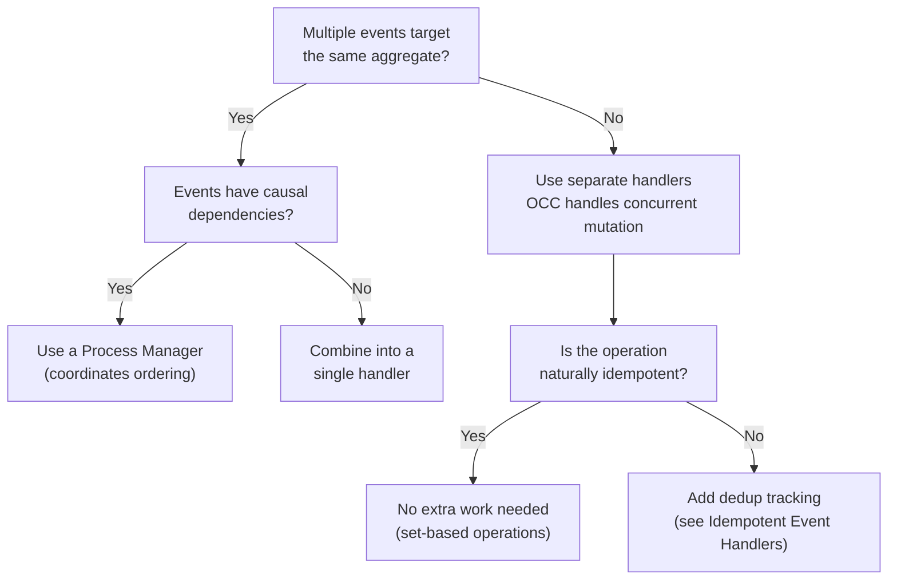

# Designing for Concurrent Event Processing

## The Problem

A developer builds a HubSpot integration with two event handlers. One
handles Client Creation (CC) webhooks, the other handles Client-Contact
Association Changes (CCA). When a user creates a client in HubSpot, both
webhooks fire in rapid succession:

```python
@domain.event_handler(part_of=Client)
class ClientCreationHandler(BaseEventHandler):
    @handle(HubspotClientCreated)
    def on_created(self, event: HubspotClientCreated):
        repo = current_domain.repository_for(Client)
        client = Client(hubspot_id=event.hubspot_id, name=event.name)
        repo.add(client)


@domain.event_handler(part_of=Client)
class ClientAssociationHandler(BaseEventHandler):
    @handle(HubspotAssociationChanged)
    def on_association_changed(self, event: HubspotAssociationChanged):
        repo = current_domain.repository_for(Client)
        try:
            client = repo.get_by_hubspot_id(event.hubspot_id)
        except ObjectNotFoundError:
            # Client doesn't exist yet -- create it
            client = Client(hubspot_id=event.hubspot_id)
        client.update_contacts(event.contacts)
        repo.add(client)
```

In production, two workers pick up these events concurrently. The CC
handler begins creating the Client aggregate. Simultaneously, the CCA
handler looks for the Client, doesn't find it yet (CC hasn't committed),
and creates its own copy. Result: duplicate Client records.

This bug is invisible in single-worker testing, code review, and local
development. It only manifests under production concurrency.

The "find or create" pattern in the CCA handler *looks* reasonable. But
it is fundamentally unsafe in a concurrent environment because it assumes
that reads and writes from different handlers are serialized. They are
not.

---

## The Four Concurrency Problem Classes

The HubSpot incident is one instance of a broader class of concurrency
issues in event-driven systems. Understanding the taxonomy helps you pick
the right solution.

### Class 1: Concurrent entity creation

Multiple events trigger creation logic for the same aggregate. Without
coordination, duplicates are created.

**Example:** Two webhooks both try to create the same Client. The first
handler's write hasn't committed when the second handler checks for
existence.

### Class 2: Concurrent aggregate mutation

Multiple events modify the same aggregate instance simultaneously.
Without version checking, the last write silently overwrites the first,
losing state changes.

**Example:** Two handlers update the same Order's status concurrently.
One sets it to "paid", the other to "shipped". The last writer wins, and
one status change is lost.

### Class 3: Causal dependency violation

Event B depends on the side effects of event A (e.g., B reads an entity
that A creates). When processed concurrently, B may execute before A's
effects are visible.

**Example:** An `AssociationChanged` event expects a Client that was
created by a `ClientCreated` event that hasn't been committed yet.

### Class 4: Duplicate processing

The same event is delivered to the same handler twice (at-least-once
delivery). Without idempotency, the handler's side effects are applied
twice.

**Example:** A server crash between event processing and subscription
position update causes the event to be redelivered on restart.

---

## The Pattern

Map each concurrency problem class to the Protean mechanism that
addresses it. Don't invent new infrastructure -- compose the existing
building blocks.

| Problem Class | Primary Solution | Protean Mechanism |
|--------------|-----------------|-------------------|
| Concurrent creation | Process Manager or single handler | `@domain.process_manager` with `correlate` |
| Concurrent mutation | Optimistic concurrency control | Automatic `_version` + `@handle` retry |
| Causal dependency | Process Manager | PM tracks state, buffers until prerequisites met |
| Duplicate processing | Idempotent operations | Set-based design, dedup tracking |

The key insight: **most concurrency bugs in event-driven systems are
structural problems, not infrastructure problems.** They arise from
handler topology (which handlers process which events) rather than from
missing framework features. Restructuring how handlers are organized
eliminates the race conditions entirely.

---

## How Protean Already Protects You

### Optimistic Concurrency Control (always-on)

Every aggregate has an automatic `_version` field. The DAO checks this
version on every save and raises `ExpectedVersionError` if another
transaction modified the aggregate since it was loaded. The `@handle`
decorator automatically retries on version conflicts with exponential
backoff:

```toml
# domain.toml — these are the defaults
[server.version_retry]
enabled = true
max_retries = 3
base_delay_seconds = 0.05
max_delay_seconds = 1.0
```

This means **Class 2 (concurrent mutation) is already handled.** If two
handlers modify the same aggregate concurrently, one succeeds and the
other retries with fresh state. You don't need to opt into this -- it is
the default behavior.

For a deep dive into classifying version conflicts by business meaning,
see [Optimistic Concurrency as Design Tool](optimistic-concurrency-as-design-tool.md).

### Process Managers (for coordination)

When events have causal dependencies -- one event must be processed
before another can safely execute -- a
[Process Manager](coordinating-long-running-processes.md) is the
DDD-correct solution. The PM correlates related events, tracks what has
happened, and issues commands in the right order.

### Idempotent handler patterns (for duplicates)

Protean's at-least-once delivery means every event handler must be safe
to run more than once. The
[Idempotent Event Handlers](idempotent-event-handlers.md) pattern
covers three strategies: naturally idempotent operations, deduplication,
and upserts.

### Command idempotency (at the submission boundary)

For commands submitted by external callers, Protean provides a
Redis-backed `IdempotencyStore` that prevents duplicate processing.
See [Command Idempotency](command-idempotency.md).

---

## Applying the Pattern

The HubSpot bug can be fixed in three ways. Choose based on the
complexity of your integration.

### Solution A: Combine into a single handler

The simplest fix. If both events target the same aggregate, a single
handler serializes processing naturally -- within one handler's
subscription, events are processed sequentially.

```python
@domain.event_handler(part_of=Client)
class HubspotClientHandler(BaseEventHandler):

    @handle(HubspotClientCreated)
    def on_created(self, event: HubspotClientCreated):
        repo = current_domain.repository_for(Client)
        client = Client(hubspot_id=event.hubspot_id, name=event.name)
        repo.add(client)

    @handle(HubspotAssociationChanged)
    def on_association_changed(self, event: HubspotAssociationChanged):
        repo = current_domain.repository_for(Client)
        client = repo.get_by_hubspot_id(event.hubspot_id)
        # No "find or create" -- the Client was created by on_created,
        # which ran first because events are ordered within a handler
        client.update_contacts(event.contacts)
        repo.add(client)
```

This works because a single handler subscription processes events from
the same stream sequentially. The `HubspotClientCreated` event is always
processed before the `HubspotAssociationChanged` event.

**When to use:** Both events target the same aggregate. The handling
logic is simple. No cross-aggregate coordination needed.

### Solution B: Process Manager

When the integration involves multiple aggregates or complex state
tracking, a Process Manager provides explicit coordination:

```python
@domain.process_manager(part_of=Client)
class HubspotClientOnboarding(BaseProcessManager):
    hubspot_id = String(identifier=True)
    client_created = Boolean(default=False)
    pending_contacts = List(content_type=String, default=list)

    class Meta:
        stream_category = "hubspot"

    @handle(HubspotClientCreated, start=True)
    def on_created(self, event: HubspotClientCreated):
        self.client_created = True
        self.hubspot_id = event.hubspot_id
        current_domain.process(
            CreateClient(hubspot_id=event.hubspot_id, name=event.name)
        )

        # Process any contacts that arrived before the client was created
        if self.pending_contacts:
            current_domain.process(
                UpdateClientContacts(
                    hubspot_id=self.hubspot_id,
                    contacts=self.pending_contacts,
                )
            )
            self.pending_contacts = []

    @handle(HubspotAssociationChanged)
    def on_association_changed(self, event: HubspotAssociationChanged):
        if not self.client_created:
            # Buffer -- the client hasn't been created yet
            self.pending_contacts = event.contacts
            return

        current_domain.process(
            UpdateClientContacts(
                hubspot_id=event.hubspot_id,
                contacts=event.contacts,
            )
        )

    correlate = {"HubspotClientCreated": "hubspot_id"}
```

The PM handles out-of-order delivery gracefully. If the association event
arrives before the creation event, the contacts are buffered and applied
once the client exists.

**When to use:** Events have causal dependencies. Multiple aggregates
are involved. You need explicit state tracking of the integration flow.

### Solution C: Idempotent retry with unique constraints

If the aggregate has a unique business key, the database prevents
duplicates and the handler retries naturally:

```python
@domain.aggregate
class Client(BaseAggregate):
    hubspot_id = String(unique=True)
    name = String(max_length=200)
    contacts = List(content_type=String, default=list)

    def update_contacts(self, contacts: list[str]) -> None:
        self.contacts = contacts  # Set-based, naturally idempotent


@domain.event_handler(part_of=Client)
class HubspotClientHandler(BaseEventHandler):

    @handle(HubspotClientCreated)
    def on_created(self, event: HubspotClientCreated):
        repo = current_domain.repository_for(Client)
        client = Client(hubspot_id=event.hubspot_id, name=event.name)
        repo.add(client)
        # If another handler already created the Client,
        # the unique constraint raises an error and the
        # @handle decorator retries with fresh state

    @handle(HubspotAssociationChanged)
    def on_association_changed(self, event: HubspotAssociationChanged):
        repo = current_domain.repository_for(Client)
        client = repo.get_by_hubspot_id(event.hubspot_id)
        client.update_contacts(event.contacts)
        repo.add(client)
```

The unique constraint on `hubspot_id` prevents duplicates at the
database level. The `@handle` retry mechanism catches the
`ExpectedVersionError` and retries, by which time the Client created by
the other handler is visible.

**When to use:** The aggregate has a natural unique business key. Both
handlers are idempotent. The flow is simple enough that explicit
coordination is overkill.

---

## Decision Tree

When you're unsure which approach to use, follow this sequence:



**Quick rules of thumb:**

1. **Two handlers, same aggregate?** Combine into one handler. This is
   the simplest and most common fix.
2. **Events must be ordered?** Process Manager. It tracks what has
   happened and what to do next.
3. **Same aggregate modified from different streams?** OCC already
   protects you. Classify the conflict by business meaning.
4. **External system delivers duplicates?** Make the handler idempotent
   using set-based operations or dedup tracking.

---

## Anti-Patterns

### "Find or create" without coordination

```python
# UNSAFE: Race condition between find and create
client = repo.find_by_hubspot_id(hubspot_id)
if not client:
    client = Client(hubspot_id=hubspot_id)
    repo.add(client)
```

Between the `find` (returns nothing) and the `add` (creates the entity),
another handler can execute the same sequence. Both handlers see "not
found", both create the entity, and you get duplicates.

**Fix:** Use a Process Manager (Solution B), combine handlers
(Solution A), or rely on unique constraints with retry (Solution C).

### Suppressing `ExpectedVersionError`

```python
# WRONG: Silencing the version conflict
try:
    repo.add(aggregate)
except ExpectedVersionError:
    pass  # "It's fine, another handler already did it"
```

An `ExpectedVersionError` is not noise. It is a signal that concurrent
modification happened. Silencing it means you are discarding a state
change that may have been important. See
[Optimistic Concurrency as Design Tool](optimistic-concurrency-as-design-tool.md)
for how to classify these conflicts correctly.

### Assuming single-worker deployment

```python
# "This can't race because we only run one worker"
```

Single-worker deployment is a scaling decision, not a concurrency
guarantee. As soon as you add a second worker, all unprotected handlers
become vulnerable. Design for concurrency from the start -- it costs
nothing when running single-worker (the patterns are just good
architecture), but saves production incidents when you scale.

### Splitting causally dependent logic across handlers

When event A creates an entity and event B modifies it, putting them in
separate handlers creates a causal dependency that requires explicit
coordination. Either combine into one handler or use a Process Manager.
Don't rely on event ordering being preserved across handler boundaries.

---

## When Not to Use This Pattern

- **Single-handler, single-aggregate operations:** If only one handler
  modifies an aggregate and events arrive from a single stream, there is
  no concurrency risk. Protean's subscription model processes events
  sequentially within a single handler.

- **Read-only projections:** Projectors that build read models from
  events are naturally idempotent (rebuilding a projection from the same
  events produces the same result). Concurrency coordination is
  unnecessary.

- **Fire-and-forget side effects:** Handlers that send emails, call
  external APIs, or emit notifications don't modify aggregate state.
  Make them idempotent (don't send the email twice), but they don't need
  OCC or Process Managers.

---

## Summary

| Situation | Solution | Pattern Doc |
|-----------|----------|-------------|
| Two handlers racing on the same aggregate | Combine into one handler | This page |
| Events with causal dependencies | Process Manager | [Coordinating Long-Running Processes](coordinating-long-running-processes.md) |
| Concurrent aggregate mutation | OCC (already built-in) | [Optimistic Concurrency as Design Tool](optimistic-concurrency-as-design-tool.md) |
| Duplicate event delivery | Idempotent handlers | [Idempotent Event Handlers](idempotent-event-handlers.md) |
| External duplicate commands | Command idempotency store | [Command Idempotency](command-idempotency.md) |
| Classifying async failures | Error classification | [Classify Async Processing Errors](classify-async-processing-errors.md) |

The most common concurrency bug -- two handlers racing on the same
aggregate -- is a structural problem with a structural solution. Before
reaching for infrastructure (locks, partitioned streams, framework-level
deduplication), look at the handler topology. The simplest fix is usually
to combine related handlers or introduce a Process Manager.
