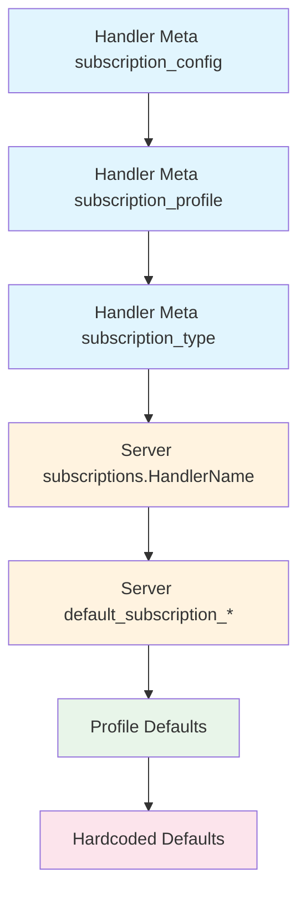

# Subscription Configuration

Protean provides a flexible configuration system for subscriptions that allows
you to configure settings at multiple levels. Configuration follows a priority
hierarchy, with more specific settings overriding general ones.

## Configuration Priority Hierarchy

Configuration is resolved using this priority order (highest to lowest):

1. **Handler Meta `subscription_config`** - Explicit configuration dict on
   handler
2. **Handler Meta `subscription_profile`** - Profile specified on handler
3. **Handler Meta `subscription_type`** - Type specified on handler
4. **Server config handler-specific** - `server.subscriptions.HandlerName`
5. **Server config defaults** - `server.default_subscription_*`
6. **Profile defaults** - Defaults from the resolved profile
7. **Hardcoded defaults** - Built-in fallback values



## Configuration Profiles

Profiles provide pre-configured settings optimized for common scenarios. Using
profiles simplifies configuration while still allowing overrides.

### Available Profiles

| Profile | Type | Description |
|---------|------|-------------|
| `production` | Stream | High throughput with reliability guarantees |
| `fast` | Stream | Low-latency processing |
| `batch` | Stream | High-volume batch processing |
| `debug` | Stream | Development and debugging |
| `projection` | Event Store | Building read models |

### Profile Defaults

#### `production` Profile

Optimized for production workloads with reliability guarantees:

```python
{
    "subscription_type": "stream",
    "messages_per_tick": 100,
    "tick_interval": 0,
    "blocking_timeout_ms": 5000,
    "max_retries": 3,
    "retry_delay_seconds": 1,
    "enable_dlq": True,
    "position_update_interval": 10,
}
```

#### `fast` Profile

Optimized for low-latency processing:

```python
{
    "subscription_type": "stream",
    "messages_per_tick": 10,
    "tick_interval": 0,
    "blocking_timeout_ms": 100,
    "max_retries": 2,
    "retry_delay_seconds": 0,
    "enable_dlq": True,
    "position_update_interval": 5,
}
```

#### `batch` Profile

Optimized for high-throughput batch processing:

```python
{
    "subscription_type": "stream",
    "messages_per_tick": 500,
    "tick_interval": 0,
    "blocking_timeout_ms": 10000,
    "max_retries": 5,
    "retry_delay_seconds": 2,
    "enable_dlq": True,
    "position_update_interval": 50,
}
```

#### `debug` Profile

Optimized for development and debugging:

```python
{
    "subscription_type": "stream",
    "messages_per_tick": 1,
    "tick_interval": 1,
    "blocking_timeout_ms": 1000,
    "max_retries": 1,
    "retry_delay_seconds": 0,
    "enable_dlq": False,
    "position_update_interval": 1,
}
```

#### `projection` Profile

Optimized for building read models:

```python
{
    "subscription_type": "event_store",
    "messages_per_tick": 100,
    "tick_interval": 0,
    "position_update_interval": 10,
    "enable_dlq": False,  # Not supported for event_store
}
```

## Configuration Options Reference

### Common Options

| Option | Type | Default | Description |
|--------|------|---------|-------------|
| `subscription_type` | string | `"stream"` | Subscription type: `"stream"` or `"event_store"` |
| `messages_per_tick` | int | 10 | Messages to process per batch |
| `tick_interval` | int | 1 | Seconds between polling cycles |

### StreamSubscription Options

| Option | Type | Default | Description |
|--------|------|---------|-------------|
| `blocking_timeout_ms` | int | 5000 | Blocking read timeout in milliseconds |
| `max_retries` | int | 3 | Retry attempts before moving to DLQ |
| `retry_delay_seconds` | int | 1 | Delay between retries |
| `enable_dlq` | bool | true | Enable dead letter queue |

### EventStoreSubscription Options

| Option | Type | Default | Description |
|--------|------|---------|-------------|
| `position_update_interval` | int | 10 | Messages between position writes |
| `origin_stream` | string | None | Filter by origin stream category |

## Configuration Methods

### 1. Handler Decorator Options

Configure directly on the handler decorator:

```python
@domain.event_handler(
    part_of=Order,
    subscription_type="stream",
    subscription_profile="production",
    subscription_config={
        "messages_per_tick": 50,
        "enable_dlq": True,
    }
)
class OrderEventHandler:
    @handle(OrderCreated)
    def handle_order_created(self, event):
        ...
```

The options combine with priority:

1. `subscription_config` values override everything
2. `subscription_profile` provides base defaults
3. `subscription_type` sets the subscription type

### 2. Domain Configuration File

Configure in `domain.toml`:

```toml
[server]
# Default settings for all handlers
default_subscription_type = "stream"
default_subscription_profile = "production"
messages_per_tick = 100

# StreamSubscription defaults
[server.stream_subscription]
blocking_timeout_ms = 5000
max_retries = 3
retry_delay_seconds = 1
enable_dlq = true

# EventStoreSubscription defaults
[server.event_store_subscription]
position_update_interval = 10

# Handler-specific overrides
[server.subscriptions.OrderEventHandler]
profile = "fast"
messages_per_tick = 50

[server.subscriptions.InventoryProjector]
subscription_type = "event_store"
profile = "projection"
```

### 3. Environment-Specific Configuration

Use environment sections for different deployment environments:

```toml
# Development defaults
[server]
default_subscription_profile = "debug"

# Production overrides
[prod.server]
default_subscription_profile = "production"
messages_per_tick = 200

[prod.server.stream_subscription]
max_retries = 5
enable_dlq = true

# Staging overrides
[staging.server]
default_subscription_profile = "fast"
```

## Configuration Examples

### Example 1: Production Event Handler

A handler with production settings and custom batch size:

```python
@domain.event_handler(
    part_of=Order,
    subscription_profile="production",
    subscription_config={
        "messages_per_tick": 200,  # Higher throughput
    }
)
class OrderEventHandler:
    ...
```

Resolved configuration:
```python
{
    "subscription_type": "stream",      # From profile
    "messages_per_tick": 200,           # From subscription_config (override)
    "blocking_timeout_ms": 5000,        # From profile
    "max_retries": 3,                   # From profile
    "retry_delay_seconds": 1,           # From profile
    "enable_dlq": True,                 # From profile
}
```

### Example 2: Low-Latency Handler

A handler optimized for fast processing:

```python
@domain.event_handler(
    part_of=Notification,
    subscription_profile="fast",
)
class NotificationEventHandler:
    ...
```

Resolved configuration:
```python
{
    "subscription_type": "stream",
    "messages_per_tick": 10,
    "blocking_timeout_ms": 100,         # Short timeout for quick response
    "max_retries": 2,
    "retry_delay_seconds": 0,           # No delay between retries
    "enable_dlq": True,
}
```

### Example 3: Projection Handler

A projector using EventStoreSubscription:

```python
@domain.projector(
    stream_categories=["order", "inventory"],
    subscription_profile="projection",
)
class OrderSummaryProjector:
    ...
```

Resolved configuration:
```python
{
    "subscription_type": "event_store",  # Direct event store access
    "messages_per_tick": 100,
    "tick_interval": 0,
    "position_update_interval": 10,
    "enable_dlq": False,                 # Not supported
}
```

### Example 4: Mixed Configuration

Combining domain config with handler config:

```toml
# domain.toml
[server]
default_subscription_profile = "production"

[server.subscriptions.SpecialHandler]
messages_per_tick = 500
max_retries = 10
```

```python
@domain.event_handler(
    part_of=Order,
    subscription_config={
        "enable_dlq": False,  # Highest priority - overrides everything
    }
)
class SpecialHandler:
    ...
```

Resolved configuration:
```python
{
    "subscription_type": "stream",      # From profile (via server default)
    "messages_per_tick": 500,           # From server.subscriptions.SpecialHandler
    "max_retries": 10,                  # From server.subscriptions.SpecialHandler
    "enable_dlq": False,                # From handler subscription_config (override)
    "blocking_timeout_ms": 5000,        # From profile
    "retry_delay_seconds": 1,           # From profile
}
```

### Example 5: Origin Stream Filtering

Filter events by their origin stream:

```python
@domain.event_handler(
    part_of=Notification,
    stream_category="order",
    source_stream="user_actions",  # Only events from user_actions origin
    subscription_type="event_store",
)
class UserActionNotificationHandler:
    """Send notifications only for user-initiated order events."""

    @handle(OrderShipped)
    def notify_user(self, event):
        # Only called for OrderShipped events that originated from user_actions
        ...
```

## Configuration Validation

Protean validates configuration and provides helpful error messages:

### Outbox / Subscription Type Conflict

Setting `enable_outbox = true` with `default_subscription_type = "event_store"`
is a configuration error.  The outbox publishes events to Redis Streams, but
event-store subscriptions never read from them, resulting in a broken pipeline.

```
ConfigurationError: Configuration conflict: 'enable_outbox' is True but
'server.default_subscription_type' is 'event_store'. When outbox is enabled,
subscription type must be 'stream' so that subscriptions read from the broker
where the outbox publishes. Either set server.default_subscription_type = 'stream'
or remove enable_outbox.
```

Setting `default_subscription_type = "stream"` automatically enables the outbox
without needing to set `enable_outbox` at all.

### Invalid Subscription Type

```python
@domain.event_handler(subscription_type="invalid")
```

```
ConfigurationError: Unknown subscription type: 'invalid'.
Valid types are: stream, event_store
```

### Invalid Profile

```python
@domain.event_handler(subscription_profile="nonexistent")
```

```
ConfigurationError: Unknown subscription profile: 'nonexistent'.
Valid profiles are: production, fast, batch, debug, projection
```

### Incompatible Options

```python
@domain.event_handler(
    subscription_type="event_store",
    subscription_config={"enable_dlq": True}
)
```

```
ConfigurationError: Invalid subscription configuration:
enable_dlq is not supported for EVENT_STORE subscription type.
EventStoreSubscription handles messages without DLQ support.
```

## Best Practices

### 1. Use Profiles as a Starting Point

Start with a profile and override specific options:

```python
@domain.event_handler(
    part_of=Order,
    subscription_profile="production",
    subscription_config={
        "messages_per_tick": 50,  # Adjust based on your workload
    }
)
```

### 2. Configure at the Right Level

- **Handler level**: Handler-specific tuning
- **Server config**: Domain-wide defaults
- **Environment config**: Environment-specific overrides

### 3. Use `debug` Profile in Development

```toml
# domain.toml (development)
[server]
default_subscription_profile = "debug"
```

### 4. Monitor and Adjust

Start with conservative settings and adjust based on monitoring:

```python
# Start conservative
subscription_config={"messages_per_tick": 10}

# Increase after monitoring shows capacity
subscription_config={"messages_per_tick": 100}
```

### 5. Enable DLQ in Production

Always enable DLQ for production workloads to capture failed messages:

```python
subscription_config={"enable_dlq": True}
```

## Next Steps

- [Subscription Types](subscription-types.md) - Deep dive into subscription
  types
- [Running the Server](../../guides/server/index.md) - CLI options and deployment
