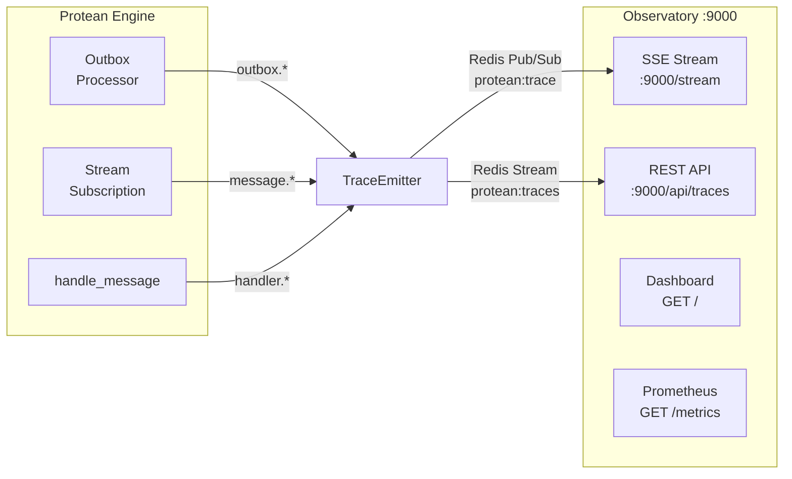

# Observability

Protean provides built-in observability for the async message processing
pipeline. Two components work together to give you real-time visibility into
how messages flow through the engine:

- **TraceEmitter** -- Lightweight instrumentation embedded in the engine that
  emits structured trace events as messages are processed.
- **Protean Observatory** -- A standalone monitoring server that subscribes to
  those trace events and exposes them through a dashboard, SSE stream, REST
  API, and Prometheus metrics endpoint.



The TraceEmitter writes to two Redis channels:

- **Pub/Sub** (`protean:trace`) -- Real-time fan-out for live SSE clients. The
  emitter checks `PUBSUB NUMSUB` and skips publishing when nobody is listening.
- **Stream** (`protean:traces`) -- Time-bounded history for the dashboard and
  REST API. Always writes when persistence is enabled (the default). Old entries
  are automatically trimmed using Redis `MINID` based on the configured
  retention period.

## Trace events

The TraceEmitter publishes structured `MessageTrace` events at key points in
the message processing pipeline. Each trace event captures:

| Field | Description |
|-------|-------------|
| `event` | Stage identifier (see table below) |
| `domain` | Domain name |
| `stream` | Stream category (e.g. `identity::customer`) |
| `message_id` | Domain event or command UUID |
| `message_type` | Class name (e.g. `CustomerRegistered`) |
| `status` | `ok`, `error`, or `retry` |
| `handler` | Handler class name (when applicable) |
| `duration_ms` | Processing time in milliseconds (handler stages) |
| `error` | Error message (failure stages) |
| `metadata` | Extra context dict |
| `correlation_id` | Correlation chain identifier (shared by all messages in a business operation) |
| `causation_id` | Parent message identifier (the `headers.id` of the message that caused this one) |
| `worker_id` | Subscription instance that processed this message |
| `timestamp` | ISO 8601 UTC timestamp |

### Event types

| Event | Emitted by | When |
|-------|-----------|------|
| `handler.started` | Engine | Before a handler processes a message |
| `handler.completed` | Engine | After successful handler execution |
| `handler.failed` | Engine | When a handler raises an exception |
| `message.acked` | StreamSubscription | After a message is acknowledged |
| `message.nacked` | StreamSubscription | When a message is returned to pending |
| `message.dlq` | StreamSubscription | When a message is moved to the dead letter queue |
| `outbox.published` | OutboxProcessor | After a message is published to the broker |
| `outbox.failed` | OutboxProcessor | When outbox publishing fails |

The `correlation_id` and `causation_id` fields enable grouping and filtering
trace events by business operation in the Observatory dashboard. For a
complete guide on how these IDs propagate through the system, see
[Correlation and Causation IDs](../../guides/observability/correlation-and-causation.md).

## Trace persistence and retention

By default, the TraceEmitter persists trace events to a Redis Stream
(`protean:traces`) for 7 days. This allows the dashboard and REST API to serve
historical data even after SSE clients disconnect.

### Configuration

Set `trace_retention_days` in your domain configuration:

```toml
# domain.toml
[observatory]
trace_retention_days = 7   # Default: 7 days. Set to 0 to disable persistence.
```

When `trace_retention_days` is set to `0`, persistence is disabled and only
real-time Pub/Sub streaming is available. The REST API trace endpoints will
return empty results.

Old entries are automatically trimmed using Redis `MINID`-based trimming on
every write, so no separate cleanup process is needed.

## Zero-overhead design

The TraceEmitter is designed to add no measurable overhead when nobody is
listening and persistence is disabled:

1. **Lazy initialization** -- The Redis connection is not established until the
   first emit call.
2. **Subscriber check** -- Before serializing any trace, the emitter runs
   `PUBSUB NUMSUB` to check if anyone is subscribed to the trace channel. This
   result is cached for 2 seconds.
3. **Short-circuit** -- If no Pub/Sub subscribers are found *and* persistence is
   disabled (`trace_retention_days = 0`), `emit()` returns immediately without
   constructing or serializing the `MessageTrace`.
4. **Silent failure** -- If Redis is unavailable or publishing fails, the error
   is logged at DEBUG level and swallowed. Tracing never affects message
   processing.

When persistence is enabled (the default), the Stream write always occurs
regardless of whether any SSE clients are connected. The Pub/Sub broadcast
is still conditional on subscriber count.

## Protean Observatory

The Observatory is a standalone FastAPI server that subscribes to trace events
and provides multiple monitoring interfaces. It runs on its own port (default
9000), separate from your application.

### Starting the Observatory

```python
from protean.server.observatory import Observatory

# Single domain
observatory = Observatory(domains=[domain])
observatory.run(port=9000)

# Multi-domain monitoring
observatory = Observatory(domains=[identity, catalogue, orders])
observatory.run(port=9000)
```

For deployment with uvicorn directly:

```python
from protean.server.observatory import create_observatory_app

app = create_observatory_app(domains=[identity, catalogue])

# Then run with: uvicorn my_module:app --host 0.0.0.0 --port 9000
```

### Endpoints

#### Dashboard -- `GET /`

An embedded HTML dashboard that connects to the SSE stream and displays
real-time message flow. Open `http://localhost:9000` in your browser.

The dashboard includes a **DLQ tab** alongside Messages, Events, and Errors.
The DLQ tab provides a filterable list of failed messages with buttons to
inspect, replay, or purge entries — the same operations available through the
[`protean dlq`](../cli/data/dlq.md) CLI commands and the `/api/dlq/*` REST
endpoints documented below.

#### SSE stream -- `GET /stream`

Server-Sent Events endpoint for real-time trace streaming. Supports
server-side filtering via query parameters:

| Parameter | Description | Example |
|-----------|-------------|---------|
| `domain` | Filter by domain name | `?domain=identity` |
| `stream` | Filter by stream category | `?stream=identity::customer` |
| `event` | Filter by event type (glob) | `?event=handler.*` |
| `type` | Filter by message type (glob) | `?type=Customer*` |

```bash
# Stream all events
curl -N http://localhost:9000/stream

# Stream only handler failures
curl -N "http://localhost:9000/stream?event=handler.failed"

# Stream events for a specific domain and stream
curl -N "http://localhost:9000/stream?domain=identity&stream=identity::customer"
```

Each SSE message has `event: trace` and a JSON `data` payload matching the
`MessageTrace` structure.

#### Health -- `GET /api/health`

Infrastructure health check returning broker connectivity, version, memory
usage, and throughput:

```json
{
  "status": "ok",
  "domains": ["identity", "catalogue"],
  "infrastructure": {
    "broker": {
      "healthy": true,
      "version": "7.2.4",
      "connected_clients": 5,
      "memory": "2.50M",
      "uptime_seconds": 86400,
      "ops_per_sec": 142
    }
  }
}
```

#### Outbox -- `GET /api/outbox`

Outbox message counts per domain, broken down by status:

```json
{
  "identity": {
    "status": "ok",
    "counts": {"PENDING": 3, "PUBLISHED": 1250, "FAILED": 0}
  }
}
```

#### Streams -- `GET /api/streams`

Redis stream lengths, message counts, and consumer group information:

```json
{
  "message_counts": {"total_messages": 2139, "in_flight": 5},
  "streams": {"count": 8},
  "consumer_groups": {"identity::user": [...]}
}
```

#### Stats -- `GET /api/stats`

Combined outbox and stream statistics for dashboard consumption.

#### Trace history -- `GET /api/traces`

Query persisted trace history from the Redis Stream. Returns traces in
reverse chronological order (newest first).

| Parameter | Description | Default |
|-----------|-------------|---------|
| `count` | Number of traces to return (1--1000) | `200` |
| `domain` | Filter by domain name | all |
| `stream` | Filter by stream category | all |
| `event` | Filter by event type | all |
| `message_id` | Filter by message ID (lifecycle lookup) | all |

```bash
# Recent 200 traces
curl http://localhost:9000/api/traces

# Last 50 traces for a specific domain
curl "http://localhost:9000/api/traces?count=50&domain=identity"

# Trace the lifecycle of a specific message
curl "http://localhost:9000/api/traces?message_id=abc-123-def"
```

The `message_id` filter returns all trace events for a single message across
its entire lifecycle (handler.started, handler.completed, message.acked, etc.),
making it useful for debugging individual message flows.

```json
{
  "traces": [
    {
      "event": "handler.completed",
      "domain": "identity",
      "stream": "identity::customer",
      "message_id": "abc-123",
      "message_type": "CustomerRegistered",
      "status": "ok",
      "handler": "CustomerProjector",
      "duration_ms": 12.5,
      "timestamp": "2025-01-15T10:30:00Z",
      "_stream_id": "1705312200000-0"
    }
  ],
  "count": 1
}
```

#### Trace statistics -- `GET /api/traces/stats`

Aggregated statistics over a time window, including event type breakdown,
error rate, and average handler latency.

| Parameter | Description | Default |
|-----------|-------------|---------|
| `window` | Time window: `5m`, `15m`, `1h`, `24h`, or `7d` | `5m` |

```bash
# Stats for the last 5 minutes
curl http://localhost:9000/api/traces/stats

# Stats for the last 24 hours
curl "http://localhost:9000/api/traces/stats?window=24h"
```

```json
{
  "window": "5m",
  "counts": {
    "handler.started": 42,
    "handler.completed": 40,
    "handler.failed": 2,
    "message.acked": 40,
    "outbox.published": 15
  },
  "error_count": 2,
  "error_rate": 1.44,
  "avg_latency_ms": 8.75,
  "total": 139
}
```

The `error_rate` is the percentage of trace events that are error types
(`handler.failed` or `message.dlq`). The `avg_latency_ms` is calculated from
`handler.completed` events only.

#### Subscriptions -- `GET /api/subscriptions`

Subscription lag status for all domains. Returns per-subscription lag,
pending count, DLQ depth, and summary aggregation. Works without the engine
running -- queries infrastructure directly.

```bash
curl http://localhost:9000/api/subscriptions
```

```json
{
  "identity": {
    "status": "ok",
    "subscriptions": [
      {
        "name": "identity-customer-projector-customer",
        "handler_name": "CustomerProjector",
        "subscription_type": "event_store",
        "stream_category": "customer",
        "lag": 0,
        "pending": 0,
        "current_position": "42",
        "head_position": "42",
        "status": "ok",
        "consumer_count": 0,
        "dlq_depth": 0
      }
    ],
    "summary": {
      "total": 3,
      "ok": 2,
      "lagging": 1,
      "unknown": 0,
      "total_lag": 5,
      "total_pending": 3,
      "total_dlq": 0
    }
  }
}
```

#### DLQ Messages -- `GET /api/dlq`

List dead letter queue messages across all subscriptions. Returns messages
sorted by failure time (newest first).

| Parameter | Description | Default |
|-----------|-------------|---------|
| `subscription` | Filter by stream category | all |
| `limit` | Maximum messages to return | `100` |

```bash
# List all DLQ messages
curl http://localhost:9000/api/dlq

# Filter by subscription
curl "http://localhost:9000/api/dlq?subscription=order&limit=50"
```

```json
{
  "entries": [
    {
      "dlq_id": "1705312200000-0",
      "original_id": "abc-123",
      "stream": "order",
      "consumer_group": "tests.order_handler.OrderEventHandler",
      "payload": {"type": "OrderPlaced", "data": {"order_id": "123"}},
      "failure_reason": "ConnectionError: database unavailable",
      "failed_at": "2025-01-15T10:30:00Z",
      "retry_count": 3,
      "dlq_stream": "order:dlq"
    }
  ],
  "total": 1,
  "subscriptions": ["order", "payment"]
}
```

#### DLQ Inspect -- `GET /api/dlq/{dlq_id}`

Inspect a single DLQ message with full payload details.

```bash
curl http://localhost:9000/api/dlq/1705312200000-0
```

#### DLQ Replay -- `POST /api/dlq/{dlq_id}/replay`

Replay a single DLQ message back to its original stream for reprocessing.

```bash
curl -X POST http://localhost:9000/api/dlq/1705312200000-0/replay
```

```json
{"status": "ok", "replayed": true, "dlq_id": "1705312200000-0"}
```

#### DLQ Replay All -- `POST /api/dlq/replay-all`

Replay all DLQ messages for a subscription. The `subscription` query parameter
is required.

```bash
curl -X POST "http://localhost:9000/api/dlq/replay-all?subscription=order"
```

```json
{"status": "ok", "replayed_count": 5, "subscription": "order"}
```

#### DLQ Purge -- `DELETE /api/dlq`

Purge all DLQ messages for a subscription. The `subscription` query parameter
is required.

```bash
curl -X DELETE "http://localhost:9000/api/dlq?subscription=order"
```

```json
{"status": "ok", "purged_count": 5, "subscription": "order"}
```

#### Queue Depth -- `GET /api/queue-depth`

Queue depth snapshot for backpressure visualization. Returns outbox pending
counts per domain, per-stream XLEN, and per-consumer-group XPENDING.

#### Delete traces -- `DELETE /api/traces`

Clear all persisted trace history from the Redis Stream.

```bash
curl -X DELETE http://localhost:9000/api/traces
```

```json
{"status": "ok", "deleted": true}
```

#### Prometheus metrics -- `GET /metrics`

Metrics in Prometheus text exposition format, suitable for scraping by
Prometheus, Grafana Agent, or any compatible collector:

```
# HELP protean_outbox_pending Current pending outbox messages
# TYPE protean_outbox_pending gauge
protean_outbox_messages{domain="identity",status="PENDING"} 3

# HELP protean_broker_up Broker health (1=up, 0=down)
# TYPE protean_broker_up gauge
protean_broker_up 1

# HELP protean_broker_memory_bytes Broker memory usage in bytes
# TYPE protean_broker_memory_bytes gauge
protean_broker_memory_bytes 2621440

# HELP protean_stream_messages_total Total messages in streams
# TYPE protean_stream_messages_total gauge
protean_stream_messages_total 2139

# HELP protean_stream_pending Pending (in-flight) messages
# TYPE protean_stream_pending gauge
protean_stream_pending 5
```

Available metrics:

| Metric | Type | Description |
|--------|------|-------------|
| `protean_outbox_messages` | gauge | Outbox messages by domain and status |
| `protean_broker_up` | gauge | Broker health (1=up, 0=down) |
| `protean_broker_memory_bytes` | gauge | Broker memory usage in bytes |
| `protean_broker_connected_clients` | gauge | Number of connected broker clients |
| `protean_broker_ops_per_sec` | gauge | Broker operations per second |
| `protean_stream_messages_total` | gauge | Total messages across all streams |
| `protean_stream_pending` | gauge | Pending (in-flight) messages |
| `protean_streams_count` | gauge | Number of active streams |
| `protean_consumer_groups_count` | gauge | Number of consumer groups |
| `protean_subscription_lag` | gauge | Messages behind stream head (per subscription) |
| `protean_subscription_pending` | gauge | Unacknowledged messages (per subscription) |
| `protean_subscription_dlq_depth` | gauge | Dead letter queue depth (per subscription) |
| `protean_subscription_status` | gauge | Subscription health: 1=ok, 0=not ok |

### Prometheus scrape configuration

```yaml
# prometheus.yml
scrape_configs:
  - job_name: 'protean'
    scrape_interval: 15s
    static_configs:
      - targets: ['localhost:9000']
```

### CORS configuration

The Observatory enables CORS by default to allow browser-based dashboards. You
can customize the allowed origins:

```python
observatory = Observatory(
    domains=[domain],
    enable_cors=True,
    cors_origins=["https://monitoring.example.com"],
)
```

## Prerequisites

The observability system requires **Redis** as the message broker. The
TraceEmitter uses Redis Pub/Sub (channel `protean:trace`) as the transport
between the engine and the Observatory. When using the `InlineBroker` (the
default for development), the TraceEmitter gracefully no-ops -- no errors, no
overhead.

The Observatory server requires the `fastapi` and `uvicorn` packages:

```bash
pip install fastapi uvicorn
```

## OpenTelemetry integration

For production APM environments, Protean supports native OpenTelemetry
distributed tracing and metrics alongside the Observatory. When OTel is
enabled, spans cover every layer of the stack (commands, handlers, UoW,
repositories, event store, server, outbox) and the `/metrics` endpoint
automatically converges on OTel-powered Prometheus exposition.

See [OpenTelemetry Integration](../../guides/server/opentelemetry.md) for
configuration, span and metric catalogs, APM setup guides, and TraceParent
propagation details.

## Next steps

- [OpenTelemetry Integration](../../guides/server/opentelemetry.md) -- Distributed
  tracing, metrics, APM setup, and TraceParent propagation with OpenTelemetry
- [Message Tracing](../../guides/domain-behavior/message-tracing.md) -- Correlation
  and causation IDs for end-to-end traceability across commands and events
- [Engine Architecture](../../concepts/async-processing/engine.md) -- How the engine manages subscriptions
  and lifecycle
- [Running the Server](../../guides/server/index.md) -- CLI options, deployment, and monitoring
- [Subscription Types](subscription-types.md) -- StreamSubscription vs
  EventStoreSubscription
