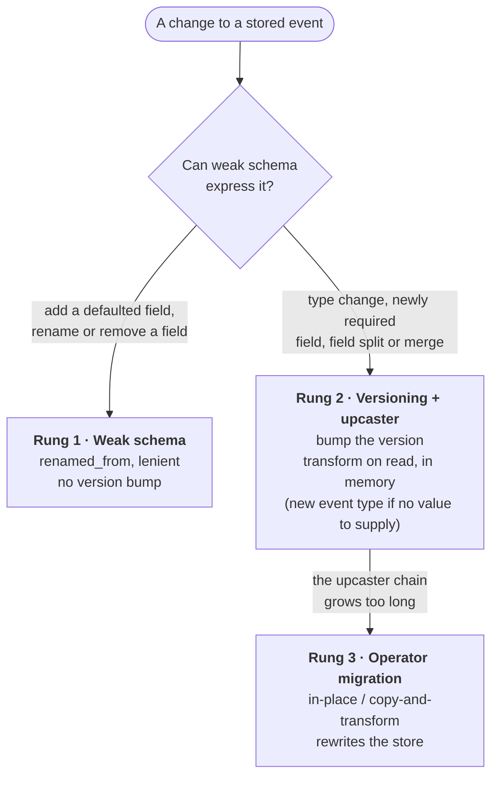

```mermaid
flowchart TD
    change(["A change to a stored event"]) --> q1{"Can weak schema<br/>express it?"}
    q1 -->|"add a defaulted field,<br/>rename or remove a field"| r1["<b>Rung 1 · Weak schema</b><br/>renamed_from, lenient<br/>no version bump"]
    q1 -->|"type change, newly required<br/>field, field split or merge"| r2["<b>Rung 2 · Versioning + upcaster</b><br/>bump the version<br/>transform on read, in memory<br/>(new event type if no value to supply)"]
    r2 -->|"the upcaster chain<br/>grows too long"| r3["<b>Rung 3 · Operator migration</b><br/>in-place / copy-and-transform<br/>rewrites the store"]
```
